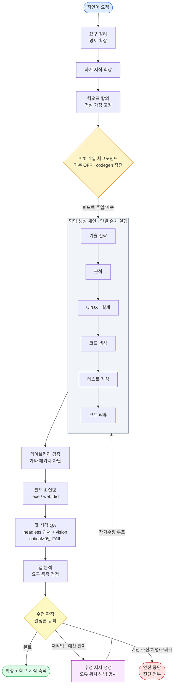
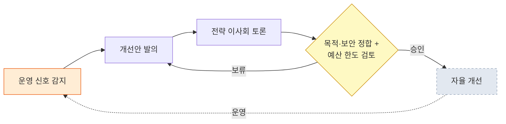

# Nexus Alpha — 아키텍처 / 프로젝트 개요

> **문서 목적**: 경영진·상급자용 개요. "이것이 무엇이고, 어디까지 *실제로 검증*되었으며, 무엇이 *아직 로드맵*인가"를 정직하게 전달합니다.
> **기준일**: 2026-06-03 (P16~P20 머지 완료 시점, 메인 브랜치 `dfdb192`).
> **작성 원칙**: **검증된 것(Verified)** = 실제로 실행·관찰·테스트된 사실만(근거 명시). **로드맵(Roadmap)** = 계획·휴면·미구현. **관찰하지 않은 동작은 서술하지 않습니다.** 코드명은 가독성을 위해 풀어 쓰되, 동작 주장에는 반드시 근거(PR/테스트/실행 evidence)를 댑니다.

---

## 0. 경영진 요약 (1페이지)

**Nexus Alpha는 사람이 자연어로 "무엇을 만들고 싶다"고 말하면, 역할이 나뉜 여러 AI 에이전트가 한 팀처럼 협업해 그 소프트웨어를 기획·구현·빌드·검증·자가수정하여 실행 가능한 산출물로 내놓는 자율 소프트웨어 생산 시스템입니다.**

- **검증된 핵심 (이번 스냅샷 기준)**:
  - **자연어 → 동작하는 앱**이 데스크탑(`.exe`)과 웹(vite `dist/`) 양쪽에서 실측 확인됨 — 검증된 앱 4종(ERP 2종·Helpdesk·Kanban, §3).
  - **웹 전(全) 주기**가 앱·하네스 양쪽에서 *타깃 인지형*으로 작동: 빌드(P18) → 자가 시각 QA(P17) → 실행/열기(P19).
  - **런 중 사람 개입(체크포인트)**: codegen 직전 정지 → 계획/스펙 표시 → 피드백 주입까지 단위 테스트 + 수동 관통 확인(P20, §5).
  - **품질 안전망**: 자동화 테스트 **Python 2,027건 + Rust 21건 전부 통과(회귀 0)**, 모든 변경은 클라우드 CI 통과 후에만 병합.
- **정직한 한계 (로드맵, §6)**:
  - **이사회 의결(Boardroom voting)**: 인프라만 존재, **휴면** — "작동한다"고 말하지 않습니다.
  - **codegen 타깃 준수**: 웹 요청에 데스크탑(Python Flet) 앱을 생성한 사례 관찰(2026-06-03) — 생성 품질/타깃 정합 이슈, 향후 수정 후보.
  - **웹 시각 QA 임계 보정**: 현재 `critical>0`만 FAIL — 임계/오탐 정밀화 필요.
  - **미구현 6 역할** + 자율 진화 라이브 1사이클 미검증.
- **한 줄로**: *핵심 파이프라인·자가수정·웹 전주기·사람 개입은 검증됐고, 거버넌스 의결·생성 타깃 정합·시각 QA 임계는 로드맵 단계입니다.*

---

## 1. 3계층 멘탈 모델 (검증됨)

시스템을 이해하는 가장 정확한 틀은 **세 개의 분리된 계층**입니다. 각 계층의 역할과 경계가 명확합니다.

| 계층 | 무엇 | 위치(코드) | 역할 / 경계 |
|---|---|---|---|
| ① **Python 하네스** | 오케스트레이션 엔진 | `src/`, `scripts/run.py` | 다중 에이전트 협업·빌드·검증·자가수정 루프의 *두뇌*. LLM 호출·LangGraph 상태 그래프·결정론 판정이 여기 있음. GUI 없이도 CLI로 단독 실행. |
| ② **Tauri GUI "Agent Office"** | 사용자 가시화 + 제어 앱 | `src-tauri/`(Rust), `frontend/`(React) | 하네스를 *사이드카로 spawn*하고 이벤트 스트림(`events.jsonl`)을 tail해 에이전트 활동을 실시간 시각화. 빌드 타깃·iteration·개입 등 **런 옵션을 UI로 노출**하고, 산출물 실행/열기를 중개. **하네스 로직은 건드리지 않음** — UI + invocation 경계. |
| ③ **생성 산출물** | 사용자가 요청한 *그 앱* | 런타임 산출(`outputs/.../code`, `dist/`, `.exe`) | 하네스가 만들어내는 결과물. 빌드 시점에 고정되어 독립 실행됨(데스크탑 `.exe` 또는 웹 `dist/index.html`). 하네스/GUI와 별개의 산물. |

> **경계가 중요한 이유**: 계층 ②(앱)의 변경은 계층 ①(하네스)을 절대 바꾸지 않으며(P18~P20이 이 규율을 엄수), 계층 ③(산출물)은 계층 ①/②와 독립적으로 동작합니다.

`[스크린샷 자리 — Agent Office: 본부 10개 + 에이전트 카드 맵 + 하단 Telemetry 스트림(실행 중 노드 강조)]`

---

## 2. 작동 방식 (요약)

사람이 한 문장으로 요청하면 내부적으로 다음 "회사"가 움직입니다.

1. **요구 정리** → 구조화 명세(기능/비기능/가정/미해결 질문)로 확장.
2. **과거 지식 회상**(RAG) → 과거 빌드 패턴·교훈 참고.
3. **킥오프 합의** → 부서 대표가 핵심 가정(플랫폼·스택)을 고정.
4. *(선택) **사람 개입 체크포인트(P20)** — codegen 직전 정지·계획 표시·피드백 주입. 기본 OFF.*
5. **협업 생성 체인** → 기술 전략 → 분석 → 설계 → **코드 생성** → 테스트 작성 → 코드 리뷰(단일 CrewAI 순차 실행).
6. **빌드 & 실행** → 데스크탑 `.exe`(PyInstaller) 또는 웹 `dist/`(vite). 샌드박스 실행.
7. **검증 & 판정** → 요구 충족·도메인 핵심 기능·빌드/실행 성공을 점검 → **완료 / 재작업 / 중단** *결정론 판정*.
8. **자가수정 루프** → "재작업"이면 *무엇을 어떻게 고칠지* 구체 지시를 만들어 생성 단계로 되먹임(예산 한도 내 반복).
9. **마무리 & 학습** → 완료 시 확정 + 회고 → 지식 베이스 축적.

---

## 3. ✅ 검증된 것 — 동작 앱 4종

> 아래는 **선행 세션에서 실제로 생성·실행하고, 수치/크로스모듈 일관성을 직접 확인한** 앱들입니다. "동작했다"는 서술은 그 관찰에 한정하며, 미관찰 동작은 적지 않습니다.

| 앱 | 타깃 | 검증된 사실 (관찰 근거) |
|---|---|---|
| **Procurement ERP** | 데스크탑 `.exe` | 구매·재고 관리. 발주서(PO) 상태 전이 **DRAFT → APPROVED → RECEIVED** 동작 확인. |
| **PSA ERP** | 웹 | 프로젝트·인력·공수·청구·대시보드. **자동계산 크로스모듈 일관성** 확인 — 인건비 = Σ(원가 × 공수), 잔여예산·소진율·마진이 모듈 간 수치 정합. |
| **Helpdesk / ITSM** | 웹 | 티켓·SLA·**MTTR·FRT·CSAT**. ★요청에 *명시되지 않은* 도메인 지표를 시스템이 **스스로 리서치해 반영**(일반화 + 도메인 리서치 증거). |
| **Kanban 보드** | 웹 | 컬럼/카드 **CRUD** + 지연(연체) 계산 동작. |

`[스크린샷 자리 — PSA ERP(web) 대시보드: 프로젝트 공수·청구·잔여예산·마진 자동계산 화면]`
`[스크린샷 자리 — Helpdesk/ITSM(web): 티켓 목록 + SLA/MTTR/FRT/CSAT 지표 패널]`
`[스크린샷 자리 — Procurement ERP(.exe): PO 상태 DRAFT→APPROVED→RECEIVED 전이 화면]`

### 3.1 웹 전(全) 주기 — 앱·하네스 양쪽 *타깃 인지형* (검증됨)

웹 산출물의 **빌드 → 시각 QA → 실행**이 데스크탑과 별개 경로로 올바르게 라우팅됩니다. 이 세 단계가 이번 P17~P19 호(弧)에서 완성됐습니다.

```
웹 요청 ─▶ [P18] 빌드(vite → dist/index.html) ─▶ [P17] 자가 시각 QA ─▶ [P19] 실행/열기
                                                  headless 캡처            vite preview
                                                  + 멀티모달 vision          + 기본 브라우저
                                                  (critical>0만 FAIL,
                                                   불가 시 graceful SKIP)
```

- **빌드(P18)**: 앱이 빌드 타깃(web/desktop/none)을 선택 → 하네스가 `_is_web_project`로 web/PyInstaller 분기.
- **시각 QA(P17)**: `dist/`를 로컬 서버(SPA fallback)로 띄워 **Playwright headless Chromium**으로 캡처 → **멀티모달 vision 평가**. 캡처/평가 불가(브라우저 미설치 등)는 **graceful SKIP**(FAIL 아님 → 파괴적 재빌드 차단), **실 시각 결함(critical>0)만 FAIL → 웹 재빌드**.
- **실행/열기(P19)**: `.html` 산출물을 `.exe`로 실행하던 결함(os error 193)을 수정 → **`vite preview` + 기본 브라우저**로 열기. 데스크탑 `.exe`는 기존 실행 경로 불변.

---

## 4. ✅ 검증된 것 — P16~P20 변경 요약

| PR | 제목 | 핵심 (검증) |
|---|---|---|
| **#249 (P16)** | 하네스 신뢰성 하드닝 | 단축 출력(빈 코드) **재생성 actuator**(P14 감지·P15 선택 보존), 그래프 `invoke` **크래시 가드**(→ BLOCKED(INTERNAL_ERROR), COMPLETE 오보 차단), **loop-back E2E**. |
| **#250 (P17)** | 웹 자가 시각 QA | `dist` 서빙 + **headless 캡처 + vision 평가**, **graceful skip**, **critical>0만 FAIL**. vision 인증을 claude-code-default로 일원화(키 폴백). |
| **#251 (P18)** | GUI 웹 빌드 + 컨트롤 | "PyInstaller 빌드" 단일 체크박스 → **빌드 타깃 선택(web/desktop/none)**, **max-iterations(1~10)**, auto-iterate/tech-scout 토글 — PowerShell 동등. |
| **#252 (P19)** | GUI ▶실행 웹 지원 | 산출물 타깃 인지(`is_web_artifact`) → 웹은 **`open_web_preview`**(vite preview + 브라우저), 데스크탑은 기존 `.exe` 실행. cargo test 18 PASS. |
| **#253 (P20)** | 런 중 사람 개입 + 가시화 | codegen 직전 정지·계획/스펙 표시·**피드백 주입**(P12 conduit 재사용). 기본 OFF. 메인 `dfdb192`. |

---

## 5. ✅ 검증된 것 — P20(사람 개입) 검증 근거 (정직하게)

> P20은 codegen 직전에 사람이 *한 번* 끼어들어 계획/스펙을 보고 피드백을 주입하는 기능입니다(기본 OFF). 아래는 **단위 테스트로 잠근 것**과 **수동으로 직접 관찰한 것**, 그리고 **아직 관찰하지 못한 것**을 구분합니다.

### 5.1 단위 테스트 (자동 검증)
- **pytest 2,027건 전부 통과** — 신규 22건(P20)이 **게이트(OFF=완전 no-op), 파일/콘솔/헤드리스 모드, 타임아웃, grace 마진(막판 제출), 피드백 주입(P12 conduit), `--non-interactive` 강제 OFF**를 박제.
- **cargo test 21건 전부 통과** — 신규 3건이 **토글 → `--intervene` 매핑** + intervention 파일 payload(JSON)를 검증.

### 5.2 수동 검증 (2026-06-03, 직접 관찰)
- **(a) 개입 OFF 베이스라인** — 토글 OFF로 런 → **정지 없음, 기존 경로와 동일**(회귀 통과).
- **(b) 개입 ON 관통** — 토글 ON으로 런 → codegen 직전 **패널 등장 + 계획/스펙 요약 표시 확인**. 패널에 *고유 토큰*을 넣고 "주입 후 계속" → 그 토큰이 `user_request → CTO → 분석 → UI/UX → 설계 → 최종 코드(`todo_app.py`)`까지 **관통**됨을 grep으로 확인. **GUI → 하네스 파일 왕복**(`intervention_in.json` 기록 → 하네스 폴링 소비) 검증.

### 5.3 ⚠️ 아직 관찰하지 못한 것 (과장 금지)
- **타임아웃 자동 닫힘**(무입력 → 카운트다운 0 → 패널 닫힘 + 런 자동 진행)은 **단위 테스트 + 카운트다운 실시간 관찰로만** 확인했고, **전체 타임아웃을 끝까지 기다린 수동 런은 실시하지 않았습니다.** 동작은 단위 테스트로 뒷받침되나, "라이브 전체 타임아웃 관찰"로 표기하지 않습니다.

---

## 6. 🗺️ 로드맵 — 휴면·계획·미구현 ("작동함"으로 쓰지 않음)

> 아래 항목은 **검증되지 않았거나 휴면 상태**입니다. 목적/역할만 기술하며 동작을 주장하지 않습니다.

### 6.1 이사회 의결 (Boardroom voting) — **휴면**
운영 신호(런타임 실패·성능 저하)를 감지해 *내부 이사회*가 개선안을 토론·의결하고 자율 개선하는 거버넌스 골격. **인프라(이벤트·세션 기록·의장/예산 노드)는 존재하나 의결의 *실 1사이클 완주는 검증되지 않았습니다*.** 목적: 자기 진화의 의사결정 게이트. 현재로선 **동작을 주장하지 않습니다.**

### 6.2 codegen 타깃 준수 — **known-issue (2026-06-03 관찰)**
**웹(SPA) 타깃 요청에도 데스크탑 Python(Flet) 앱을 생성한 사례**를 관찰했습니다(런 `outputs/alpha_run_20260603_013051`). 이후 정적 attribute 검증 실패로 `.exe` 빌드가 중단됨. **P20과 무관한 *생성 품질/타깃 정합* 이슈**로, 플랫폼 의도(web)와 실제 산출(desktop)이 어긋난 경우입니다. P14(요청 앵커링)·P16(재생성)·P17(플랫폼 인지 QA)이 완화하나 *완전히 막지는 못함* — **향후 P-fix 후보**(타깃 정합 하드 게이트). 정직한 현재 한계로 기재합니다.

### 6.3 웹 시각 QA 임계 보정 — **계획**
현재 웹 시각 QA는 **`critical>0`만 FAIL**(미평가·부분 실패는 SKIP)로, 안전(파괴적 재빌드 차단)에 치우쳐 있습니다. **임계 정밀화 + 오탐/누락 보정**(예: 경미한 레이아웃 결함의 가중, 다중 라우트 합산)이 필요합니다.

### 6.4 미구현 6 역할 — **목표/역할만**
조직도(`frontend/src/App.tsx`)에 정의된 **고유 역할 52개 중 6개가 미구현**입니다(나머지 46개 구현). 미구현 역할의 *목표/역할*만 기술하며 완성도·동작은 적지 않습니다.

| 미구현 역할 | 본부 | 의도된 역할 (미구현) |
|---|---|---|
| Product Manager | 기획·설계 | 제품 전략·우선순위 |
| Mobile Developer | 개발 | 모바일 타깃 (Phase 9) |
| Embedded Specialist | 개발 | 임베디드 타깃 (Phase 9) |
| Documentation Lead | 지식 관리 | 문서 자동화 |
| Monitoring Engineer | 운영 지원 | 운영 모니터링 |
| Cross-Agent Consultant | Coordination | 양방향 라우팅·자문 |

### 6.5 자율 진화 라이브 1사이클 — **미검증**
감지 → 이사회 토론 → 의결 → 자율 개선의 **실 LLM 1사이클 완주**는 아직 검증 전입니다(§6.1과 연결).

---

## 7. 아키텍처 (파이프라인 + 거버넌스)

### 7.1 파이프라인 + 자가수정 루프



### 7.2 자율 진화 루프 (거버넌스) — **휴면 (§6.1)**



> ⚠️ 위 거버넌스 루프는 **인프라만 존재하고 의결 동작은 휴면**입니다(점선 = 미검증).

### 7.3 조직 구조 (역량 단위)

이사회(Board) 아래 **10개 본부**, 고유 역할 **52개 중 46개 구현 / 6개 미구현**(§6.4). 핵심 실행 본부(품질 검증·디자인·빌드 & 배포)는 100% 구현.

| 본부 | 책임 | 구현 상태 |
|---|---|---|
| 거버넌스(C-Level/이사회) | 기술 전략, 목적·보안 정합, 예산 제어, 수렴 판정 | 핵심 구현 |
| 업무 분석 | 명세 확장, 갭 분석, 데이터 분석 | 구현 |
| 기획·설계 | UI/UX 판단 | 부분 구현(Product Manager 미구현) |
| 개발 | Track A 신규개발 + Track B 자동화 | 구현(모바일·임베디드 미구현) |
| 품질 검증 | 테스트·정적 리뷰·**시각 QA** + 결정론 수렴 판정 | 100% |
| 지식 관리 | 과거 빌드 지식 축적·회상(RAG) | 구현(Documentation Lead 미구현) |
| 운영 지원 | 샌드박스 실행 | 부분 구현(Monitoring 미구현) |
| 디자인 | UI 코드 생성·와이어프레임·토큰 | 100% |
| 빌드 & 배포 | 의존성·`.exe`/web 빌드·릴리스 | 100% |
| 런타임 검증(RV) | 실행 검증·UI 시나리오·실패 분석 | 구현 |
| Coordination | 이사회 의장·회고·자문 | 부분 구현(Cross-Agent Consultant 미구현) |

---

## 8. 기술 스택

| 계층 | 기술 |
|---|---|
| 언어/런타임 | Python 3.13 |
| 다중 에이전트 오케스트레이션 | CrewAI |
| 상태 기반 워크플로 그래프 | LangGraph |
| LLM | Anthropic Claude (Opus 계열) · claude-code-default(인증 일원화) |
| 데스크탑 빌드 | PyInstaller (단일 `.exe`) |
| 웹 빌드 | Node.js · npm · Vite · TypeScript · Three.js(3D) |
| 웹 시각 QA | Playwright(headless Chromium) + 멀티모달 vision |
| 사용자 시각화 앱 | Tauri(Rust) + React |
| 품질 | pytest **2,027** + cargo test **21** + 정적 분석 · 보안 스캔(CI) |
| 형상/배포 | Git · GitHub (PR 단위, CI 4/4 통과 자동 병합) |

---

## 9. 품질 / 검증 체계 (검증됨)

- 자동화 테스트 **Python 2,027건 + Rust 21건**(단위·통합·회귀)으로 핵심 로직 박제. 신규 기능은 전용 회귀 테스트와 함께 추가.
- 모든 변경은 GitHub PR로 관리, **클라우드 CI 4종(pytest · CodeQL · 보안 분석 · 시크릿 스캔)** 전부 통과 후에만 메인 병합.
- **"회귀 0" 원칙**: 새 처방이 기존 동작을 깨지 않음을 매 변경마다 전체 스위트로 확인(P16→P20 전부 회귀 0).
- **적대적 리뷰 규율**: P16~P20은 다중 에이전트 차원별 리뷰 + 회의적 검증을 거쳐, 확정 결함만 수정 후 병합.

---

## 부록 A. 파이프라인 단계 매핑 (기술 참고)

`요구 확장 → 과거 지식 회상 → 킥오프 합의 → [P20 개입 체크포인트(OFF 기본)] → 협업 생성 체인(전략→분석→설계→코드 생성→테스트→리뷰, 단일 CrewAI 순차) → 라이브러리 검증 → 샌드박스 실행 → 런타임 검증 → 갭 분석 → 수렴 판정 → {완료→회고·지식 축적 | 재작업→수정 지시→생성 체인 루프백 | 중단}`

- **수렴 판정**: 결정론 규칙 엔진. 요구 미충족·도메인 미구현·빌드 실패·반복 한도·내부 크래시(P16)를 종합해 verdict 산출.
- **자가수정 루프**: 빌드/타입 오류를 파싱해 *파일·위치·수정 방법*을 다음 회차 생성 입력으로 주입.
- **웹 시각 QA(P17)**: `dist` 서빙 → headless 캡처 → vision 평가. **불가 시 SKIP(파괴적 재빌드 차단), critical>0만 FAIL → 웹 재빌드.**
- **P20 개입**: 파일 모드(GUI; `intervention_in.json` 폴링) / 콘솔 모드(tty stdin) / 헤드리스(자동 진행). 입력은 P12 conduit으로 codegen에 주입. **OFF(기본)면 완전 no-op.**

## 부록 B. 정직성 노트 (이 문서의 근거)

- **검증된 것**의 각 항목은 PR 번호·테스트 수·실행/관찰 evidence(런 ID·grep·수동 세션 일자)에 근거합니다.
- **로드맵**의 항목은 인프라 존재 여부와 무관하게 *동작이 검증되지 않았음*을 명시했습니다(이사회 의결·자율 진화·타깃 정합·시각 QA 임계).
- 스크린샷은 `docs/assets/`의 실제 PNG만 임베드하며, 미보유분은 `[스크린샷 자리 — …]` placeholder로 표기합니다(가짜 이미지 생성 없음).

---

*기준일 2026-06-03 · 메인 `dfdb192` · P16~P20 머지 완료 시점의 스냅샷. 본 문서는 실제 저장소·테스트·실행 기록에 근거하며, 검증된 사실과 로드맵을 엄격히 구분합니다.*
