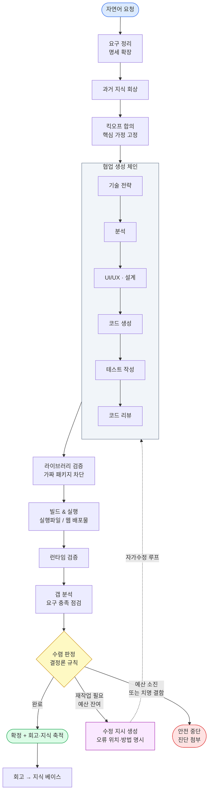
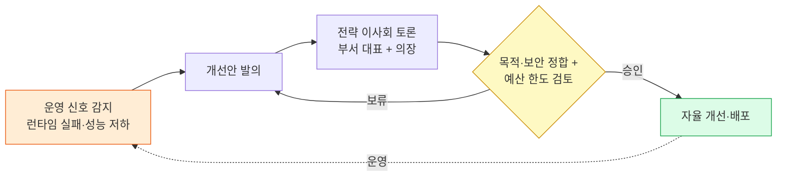

# Nexus Alpha — 아키텍처 / 프로젝트 개요

> **문서 목적**: 경영진·상급자용 개요. "이것이 무엇이고, 왜 의미 있으며, 어디까지 왔는가"를 명확하게 전달합니다.
> **기준일**: 2026-06-01 (최신 메인 브랜치 기준 합성).
> **작성 원칙**: 실제 코드베이스·테스트·진행 기록에 근거. 과장 없이 *검증된 것*과 *진행 중인 것*을 구분.

---

## 0. 경영진 요약 (1페이지)

**Nexus Alpha는 사람이 자연어로 "무엇을 만들고 싶다"고 말하면, 여러 전문 AI 에이전트가 한 팀처럼 협업해 그 소프트웨어를 *직접 기획·구현·빌드·검증·자가수정*해서 실행 가능한 산출물로 내놓는 자율 소프트웨어 생산 시스템입니다.**

- **무엇을 자동화하나**: 요구사항 해석 → 설계 → 코드 작성 → 빌드(실행 파일/웹 배포물) → 품질·실행 검증 → 결함 발견 시 *스스로 고쳐 재시도*. 사람의 개입을 최소화한 "요청에서 동작하는 소프트웨어까지"의 전 과정.
- **어떻게 다른가**: 단일 AI가 코드를 한 번 뱉는 방식이 아니라, **역할이 나뉜 다수 에이전트(분석가·설계자·코드 생성기·검증자 등)가 토론·검증·재작업을 반복**합니다. 그리고 사람이 아니라 **결정론적 판정 엔진**이 "이 산출물이 요구를 충족했는가"를 객관적으로 판단해 완료/재작업/중단을 결정합니다.
- **어디까지 왔나 (검증된 것)**:
  - 자연어 요청 → 협업 생성 → 빌드 → 실행까지 **엔드투엔드로 작동**함이 실측으로 확인됨 (데스크탑 실행 파일 풀체인은 베타 배포 준비 단계).
  - **자가수정 루프가 실제로 작동**: 빌드가 실패하면 컴파일러 오류를 분석해 구체적 수정 지시를 만들어 코드 생성기에 되먹이고, 예산 한도 내에서 다시 시도합니다.
  - 시스템 자체 품질을 지키는 **자동화 테스트 1,932건이 전부 통과**(회귀 0)하며 매 변경마다 검증됩니다.
- **무엇이 진행 중인가 (정직하게)**:
  - **요청 충실도/도메인 정확도 고도화**: 생성기가 "요청한 바로 그 제품"을 만들도록 하는 정밀화 작업이 진행 중입니다(최근, 생성기가 요청 대신 시스템 자기 자신을 닮은 산출을 내던 문제를 식별·교정했습니다).
  - **웹 타깃의 첫 완전 자율 "완료" 판정**과, 시스템이 스스로 개선안을 발의하는 **자율 진화 루프의 라이브 1사이클 검증**이 다음 관문입니다.
- **한 줄로**: *"자연어 → 동작하는 소프트웨어"를 다중 에이전트 협업과 자가수정으로 자동화하는 시스템. 핵심 파이프라인과 자가수정·거버넌스 골격은 완성·검증됐고, 지금은 산출물이 요청에 얼마나 정확히 부합하는지를 끌어올리는 단계입니다.*

---

## 1. 한 줄 정의

> **Nexus Alpha** — 자연어 요청을 입력받아, 역할이 분화된 자율 AI 에이전트 팀이 *기획→생성→빌드→검증→자가수정*을 거쳐 실행 가능한 소프트웨어를 산출하는 자기 진화형(self-evolving) 소프트웨어 생산 플랫폼.

---

## 2. 해결하는 문제 · 배경 · 가치

**문제.** 아이디어(자연어)에서 동작하는 소프트웨어까지는 분석·설계·구현·빌드·테스트·디버깅이라는 길고 전문적인 사슬을 거칩니다. 일반 AI 코드 생성은 "코드 한 조각"은 잘 만들지만, *실제로 빌드되고 실행되며 요구를 충족하는 완성품*까지 책임지지 못하고, 오류가 나면 사람이 개입해야 합니다.

**접근.** Nexus Alpha는 이 사슬 전체를 **한 팀의 전문 에이전트들에게 분담**시키고, 그 사이를 **상태를 가진 워크플로 그래프**로 잇습니다. 결과물은 객관적 판정 엔진이 검사하고, 미흡하면 *구체적 피드백과 함께 자동으로 재작업*에 들어갑니다.

**가치.**
- **속도·비용**: 반복적 구현·디버깅 노동을 자율화 → 아이디어 검증과 산출의 리드타임 단축.
- **품질의 결정론화**: "완료" 여부를 사람의 인상이 아니라 *규칙 기반 판정*으로 결정 → LLM 특유의 변동성에 휘둘리지 않음.
- **자가 개선**: 실패를 종료가 아니라 *학습·재시도 신호*로 다루어, 한 번에 안 되는 작업도 예산 내에서 스스로 수렴시킴.
- **확장성**: 새 역량(새 도메인·새 빌드 타깃)을 에이전트/단계 추가로 흡수하는 모듈식 조직 구조.

---

## 3. 작동 방식 (쉽게)

사람이 한 문장으로 요청하면, 내부적으로 다음과 같은 "회사"가 움직입니다.

1. **요구 정리**: 한 문장 요청을 구조화된 명세(기능/비기능 요구, 가정, 미해결 질문)로 확장합니다.
2. **사전 학습 회상**: 과거 빌드에서 쌓은 패턴·교훈을 불러와 참고합니다.
3. **킥오프 합의**: 부서 대표들이 핵심 가정(플랫폼, 기술 스택 등)을 합의해 *일관성*을 고정합니다.
4. **협업 생성**: 기술 전략 → 분석 → 설계 → **코드 생성** → 테스트 작성 → 코드 리뷰가 순차로 이어집니다.
5. **빌드 & 실행**: 산출 코드를 실제로 빌드(데스크탑 실행 파일 또는 웹 배포물)하고, 안전한 환경에서 실행해 봅니다.
6. **검증 & 판정**: 요구를 실제로 구현했는지(도메인 핵심 기능 포함)와 빌드/실행이 성공했는지를 점검하고, **완료 / 재작업 필요 / 중단** 중 하나로 *객관적 판정*합니다.
7. **자가수정 루프**: "재작업 필요"면, *무엇을 어떻게 고칠지*를 담은 구체적 지시를 만들어 다시 생성 단계로 되먹입니다. 빌드 오류(예: 타입 오류)는 파일·위치·수정 방법까지 짚어 전달하고 다음 회차에 재빌드합니다. 이 과정을 예산 한도 내에서 반복합니다.
8. **마무리 & 학습**: 완료되면 산출물을 확정하고, 이번 빌드의 잘된 점/문제점을 회고로 정리해 *지식 베이스에 축적*합니다(다음 빌드가 더 똑똑해짐).

여기에 더해, 시스템은 자신의 운영 신호(런타임 실패·성능 저하 등)를 감지하면 **내부 "이사회"를 소집해 개선안을 토론·의결**하는 *자기 진화* 골격을 갖추고 있습니다.

---

## 4. 아키텍처

### 4.1 조직 구조 (역량 단위)

이사회(Board) 아래 **10개 본부**로 구성되며, 정원 52개 역할 중 **47개(약 90%)가 구현**되어 있습니다. 핵심 실행 본부(품질 검증·디자인·빌드 & 배포)는 100% 구현 완료입니다.

| 영역 | 책임 | 상태 |
|------|------|------|
| **거버넌스(C-Level/이사회)** | 기술 전략, 목적·보안 정합성, 비용·예산 한도 제어, 수렴 판정 | 핵심 구현 |
| **업무 분석** | 자연어 요청 → 구조화 명세, 갭 분석, 데이터 분석 | 구현 |
| **기획·설계** | UI/UX 판단, 제품 형태 결정 | 부분 구현 |
| **개발** | 신규 개발(Track A) + 자동화 작업(Track B) — Python·웹·API·데이터·DevOps | 구현 |
| **품질 검증** | 테스트 작성·정적 리뷰·시각 검증 + **결정론적 수렴 판정** | 100% |
| **지식 관리** | 과거 빌드 지식 축적·회상(RAG) | 구현 |
| **운영 지원** | 샌드박스 실행 | 부분 구현 |
| **디자인** | UI 코드 생성·와이어프레임·디자인 토큰 | 100% |
| **빌드 & 배포** | 의존성 분석·실행 파일/웹 빌드·릴리스 | 100% |
| **런타임 검증(RV)** | 실행 파일 동작·UI 시나리오·실패 분석 — *자율 진화의 감지 노드* | 신규 구현 |
| **Coordination** | 이사회 의장(전략 토론 리드), 회고, 부서 간 자문 | 부분 구현 |

### 4.2 파이프라인 + 자가수정 루프 (다이어그램)

### 4.3 자율 진화 루프 (거버넌스)

---

## 5. 현재 상태 (정직한 구분)

### ✅ 검증된 것

- **엔드투엔드 자율 생성→빌드→실행이 작동**합니다. 자연어 요청에서 협업 생성, 실제 빌드, 실행/렌더 확인까지 라이브로 도달했습니다.
- **데스크탑 실행 파일 풀체인**(자연어 → `.exe` → 배포물)은 베타 배포 준비 수준으로 검증됐습니다.
- **웹 타깃 빌드 체인**(웹 프로젝트 인식 → 의존성 설치 → 번들 빌드 → 배포물 생성)과 **자가수정 루프**(빌드 실패 → 오류 분석 → 수정 지시 → 재시도, 끝내 타입 한정 결함만 남으면 안전 우회 빌드)가 작동합니다.
- **품질 안전망**: 자동화 테스트 **1,932건 전부 통과(회귀 0)**. 모든 변경은 클라우드 CI(테스트·정적 분석·보안 스캔) 통과 후에만 병합됩니다.
- **결정론적 수렴 판정**과 **반복 한도/안전 가드**가 작동해, 무한 루프·미완성품의 거짓 "완료"를 구조적으로 차단합니다.

### 🔧 진행 중 / 다음 관문 (과장 없이)

- **요청 충실도·도메인 정확도 고도화**: 생성기가 *요청한 바로 그 제품*을 만들도록 정밀화 중입니다. 최근, 생성기가 사용자가 요청한 제품 대신 *시스템 자기 자신을 닮은 산출*을 내던 문제를 식별해, 요청을 최상위 권위로 고정하고 내부 컨텍스트 누수를 차단하며 도메인 핵심 기능을 완료 조건으로 강제하는 교정을 적용했습니다. 라이브 재검증이 다음 단계입니다.
- **웹 타깃의 첫 완전 자율 "완료" 판정**: 위 빌드/자가수정 역량 결합으로 도달 후보 상태이며, 라이브 검증 예정.
- **자율 진화 루프의 라이브 1사이클**: 감지→이사회 토론→의결→자율 개선까지 인프라는 완비됐고, 실 LLM 1사이클 완주 검증이 남아 있습니다.
- **미구현 역할 보강**: 정원 대비 일부 역할(예: Product Manager, Monitoring Engineer 등)이 후속 구현 대상입니다.

---

## 6. 기술 스택

| 계층 | 사용 기술 |
|------|-----------|
| 언어/런타임 | Python 3.13 |
| 다중 에이전트 오케스트레이션 | CrewAI |
| 상태 기반 워크플로 그래프 | LangGraph |
| LLM | Anthropic Claude (Opus 계열) |
| 데스크탑 빌드 | PyInstaller (단일 실행 파일) |
| 웹 빌드 | Node.js · npm · Vite · TypeScript · Three.js(3D) |
| 사용자 시각화 앱 | Tauri + React (데스크탑 앱) |
| 품질 | pytest (1,932 테스트), 정적 분석, 보안 스캔 (CI) |
| 형상/배포 | Git · GitHub (PR 단위 머지, CI 통과 자동 병합) |

---

## 7. 주요 성과 · 차별점

1. **진짜 다중 에이전트 협업**: 단일 모델 1회 호출이 아니라, 역할 분담 + 부서 간 합의/토론 + 교차 검증으로 일관성을 확보.
2. **결정론적 완료 판정**: "완료"를 사람의 인상이나 LLM의 자평이 아니라 *규칙 엔진*이 결정 — 미완성품의 거짓 완료를 차단.
3. **자가수정 루프**: 빌드/검증 실패를 *구체적 수정 지시*로 변환해 자동 재작업. 한 번에 안 되는 작업도 예산 내 수렴.
4. **다중 타깃 빌드**: 데스크탑 실행 파일과 웹 배포물 양쪽을 같은 파이프라인이 인식·라우팅.
5. **도메인 충실도 게이트**: "빌드되면 끝"이 아니라 *요청의 핵심 기능을 실제로 구현했는가*까지 완료 조건으로 검증.
6. **자기 진화 거버넌스**: 운영 신호 감지 → 이사회 토론 → 목적·예산 정합 의결 → 자율 개선의 골격.
7. **검증 가능한 엔지니어링 규율**: 1,932개 자동화 테스트, 모든 변경의 CI 게이트, 회귀 0 원칙.

---

## 8. 로드맵 / 다음 단계

1. **요청 충실도 라이브 재검증** — 최근 교정(요청 앵커링·도메인 게이트) 적용 후, 생성기가 요청한 제품을 정확히 산출하는지 실측.
2. **웹 타깃 첫 자율 "완료" 달성** — 빌드 성공 + 도메인 충족 + 배포물 산출의 완전 자율 1건.
3. **베타 배포** — 소규모 사용자 코호트에 실 사용 evidence 확보.
4. **자율 진화 루프 라이브 1사이클** — 감지→토론→의결→개선 완주 검증.
5. **조직 정원 완성** — 미구현 역할(제품 전략·모니터링 등) 보강으로 자율성·일관성 추가 강화.

---

## 부록 A. 파이프라인 단계 매핑 (기술 참고)

엔드투엔드 워크플로는 상태 기반 그래프로 구현되어 있으며, 대략 다음 단계로 진행합니다:

`요구 확장 → 과거 지식 회상 → 킥오프 합의 → 협업 생성 체인(전략→분석→설계→코드 생성→테스트→리뷰) → 라이브러리 검증 → 샌드박스 실행 → 런타임 검증 → 갭 분석 → 수렴 판정 → {완료→회고·지식 축적 | 재작업→수정 지시→생성 체인으로 루프백 | 중단} `

- **수렴 판정**은 결정론 규칙 엔진으로, 요구 미충족·도메인 미구현·빌드 실패·반복 한도 등을 종합해 verdict를 산출합니다.
- **자가수정 루프**는 빌드/타입 오류를 파싱해 *파일·위치·수정 방법*을 다음 회차 생성 입력으로 주입합니다.
- **안전 가드**: 반복 횟수·예산 한도에 도달하면 무한 루프 대신 진단을 첨부해 안전하게 종료합니다.

## 부록 B. 품질 / 검증 체계

- 자동화 테스트 **1,932건**(단위·통합·회귀)로 모든 핵심 로직을 박제. 신규 기능은 전용 회귀 테스트와 함께 추가.
- 모든 변경은 GitHub PR로 관리되며, **클라우드 CI(테스트 + 정적 분석 + 보안 스캔 + 코드 분석)** 전 항목 통과 후에만 메인에 병합.
- "회귀 0" 원칙: 새 처방이 기존 동작을 깨지 않음을 매 변경마다 전체 스위트로 확인.

---

*본 문서는 실제 저장소(조직도, 아키텍처 문서, 에이전트 정의, 워크플로 코드, 변경 이력)를 최신 상태 기준으로 합성·응축한 것입니다. 내부 작업 코드명은 경영진 가독성을 위해 역량/마일스톤 언어로 풀어 기술했습니다.*
