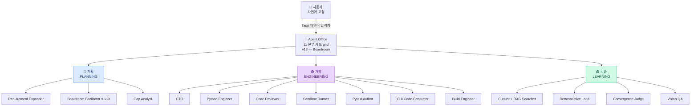
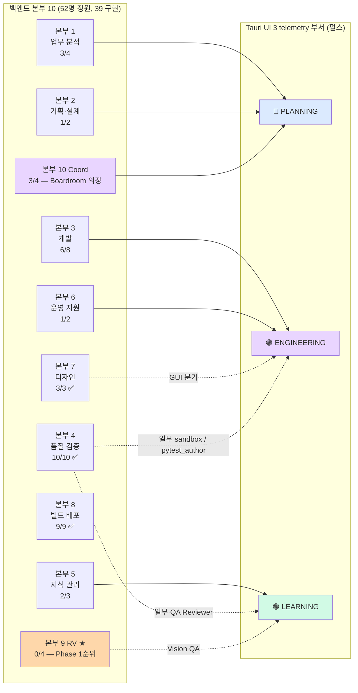

# 🏛️ Nexus Alpha — Agent Organization Chart (v13 동기화)

> **갱신일**: 2026-05-27 (PR #213 머지 후 — [Nexus_Alpha_조직도_v13.md](Nexus_Alpha_조직도_v13.md) 단일 진실 공급원 동기화)
> **목적**: 본부 10 + 정원 52 (구현 39 / 미구현 13) 백엔드 조직과 Tauri 데스크탑 앱의 3 부서 UI 매핑을 *단일 진입점* 으로 통합. v13 의 **Boardroom 기반 자기 진화** 패러다임 반영.

---

## 1. 두 차원 동시 표기

| 차원 | 내용 | 출처 |
|------|------|------|
| **백엔드 본부 10** | **52명 정원** (39 구현 / 13 미구현) — 경영진(Board) + 실무 본부 10 (v13 패러다임) | [Nexus_Alpha_조직도_v13.md](Nexus_Alpha_조직도_v13.md) |
| **Tauri UI 3 telemetry 부서** ⭐ | 🔵 기획(PLANNING) / 🟣 개발(ENGINEERING) / 🟢 학습(LEARNING) — `_NODE_DEPARTMENT` 매핑 | `src/monitoring/telemetry.py` |

본 문서는 *두 차원의 매핑* 을 명시. Tauri UI 의 11 본부 grid (PR #207) 는 *백엔드 본부 매핑* 과 1:1. 다만 telemetry 부서 (3 색상 펄스) 는 그보다 *낮은 차원* — `_NODE_DEPARTMENT` 가 11 본부를 3 grouping.

---

## 2. Tauri UI 부서 매핑 (telemetry 부서 차원)

`src/monitoring/telemetry.py` 의 `_NODE_DEPARTMENT` 매핑이 *런타임 진실*. Tauri UI 가 본 매핑으로 부서별 카드 *펄스 색상* 결정.

### 부서 ↔ 노드 매핑 (`telemetry.department_for_node`)

| 부서 | 색상 | iterative_loop 노드 | Tauri UI 펄스 활성 시점 |
|------|------|---------------------|------------------------|
| 🔵 **PLANNING** | 파랑 | `expand_requirements`, `kickoff_meeting` (= Boardroom Facilitator), `analyze_gap`, `prepare_feedback` | 회의 / 분석 / feedback 작성 중 |
| 🟣 **ENGINEERING** | 보라 | `run_chain`, `run_sandbox` | 코드 작성 / 실행 중 |
| 🟢 **LEARNING** | 청록 | `recall_past_knowledge`, `judge_convergence`, `retrospective`, `retrospective_blocked`, `curate_knowledge`, `curate_knowledge_blocked` | 회고 / RAG / 결정표 중 |
| ⚪ **SYSTEM** | 회색 | `finalize`, `escalate`, *미매핑 fallback* | 종결 (펄스 OFF) |

### v13 설계 예고 — 4 신규 노드 (미구현)

자율 진화 루프 도입 시 추가될 LangGraph 노드 — *현재 백엔드 부재*:

| 노드 | telemetry 부서 (예상) | 책임 본부 | 상태 |
|------|----------------------|----------|------|
| `runtime_verify` | (신설 *rv* 부서) | 본부 9 RV | **(v13 설계 예고 — 미구현)** |
| `boardroom_trigger` | planning (Boardroom Facilitator) | 본부 10 | **(v13 설계 예고 — 미구현)** |
| `goal_alignment_check` | (신설 *c-level* 부서) | 본부 0 Goal Alignment Agent | **(v13 설계 예고 — 미구현)** |
| `budget_brake` | (신설 *c-level* 부서) | 본부 0 Token Budget Optimizer | **(v13 설계 예고 — 미구현)** |

---

## 3. 백엔드 본부 10 ↔ Tauri 3 부서 매핑

`Nexus_Alpha_조직도_v13.md` 의 *본부 10 + 52명* 정원이 Tauri 3 부서로 *압축* 되는 매핑.

### 매핑 원칙

1. **본부 1/2/10 → 🔵 기획** — 분석/UX/Boardroom 의장
2. **본부 3/6 → 🟣 개발** — 코드/실행 흐름 (디자인 본부 7 의 GUI 분기 일부 포함)
3. **본부 5/9 + 본부 4 일부 → 🟢 학습** — 지식/검증/RV
4. **본부 4 (QA) 는 분할 매핑** — 산출물 검증 자체는 ENGINEERING (run_chain 안), retrospective/curate 는 LEARNING

---

## 4. v13 조직도 — Active agent 매트릭스 (실 코드 LLM 호출 주체)

`iterative_loop` 의 9 노드 + Track B 분기 + Build 분기에서 실제 LLM 호출이 발생하는 agent. PR #188 의 `BaseLLMProvider.generate()` finally 블록이 모두 `AgentMessageEvent` 로 캡처.

| # | Agent | 부서 | 본부 | 호출 위치 | v13 비고 |
|---|-------|------|------|-----------|----------|
| 1 | Requirement Expander | 🔵 기획 | 본부 1 | `_node_expand_requirements` | — |
| 2 | RAG Searcher (Curator 학습면) | 🟢 학습 | 본부 5 | `_node_recall_past_knowledge` | — |
| 3 | **Boardroom Facilitator** ⭐ | 🔵 기획 | 본부 10 | `_node_kickoff_meeting` | **v13 — Meeting Facilitator 격상 (전략 이사회 의장)** |
| 4 | CTO | 🟣 개발 | 본부 0 | `_node_run_chain` 내부 | — |
| 5 | Data Analyst | 🟣 개발 | 본부 1 | `_node_run_chain` 내부 (Track A/B) | (v12 의 "Product Analyst" 잔존 stale 정정 — 실 코드 = Data Analyst) |
| 6 | Python Engineer | 🟣 개발 | 본부 3 | `_node_run_chain` 내부 | — |
| 7 | Code Reviewer | 🟣 개발 | 본부 4 (QA → UI상 개발) | `_node_run_chain` 내부 | — |
| 8 | Pytest Author | 🟣 개발 | 본부 4 | Track B / build 분기 | — |
| 9 | GUI Code Generator | 🟣 개발 | 본부 7 | enable_gui_branch | — |
| 10 | Gap Analyst | 🔵 기획 | 본부 1 | `_node_analyze_gap` | — |
| 11 | Retrospective Lead | 🟢 학습 | 본부 10 | `_node_retrospective` | — |
| 12 | Knowledge Curator | 🟢 학습 | 본부 5 (+ 본부 10 promoted) | `_node_curate_knowledge` | PR #213 — 본부 10 promoted 도 implemented 카운트 |
| 13 | Vision QA (옵션) | 🟢 학습 | 본부 9 (RV) | enable_build_branch + vision_qa | — |

→ **13 active agent** = v12 / v13 동일. *Sandbox Runner* 는 결정론 (LLM 호출 X) 이라 별도.

---

## 5. v13 정원 다이어트 (54 → 52) 변경 사항

| 삭제 / 변경 | 위치 | 사유 |
|-------------|------|------|
| 🗑 Business Process Analyst | 본부 1 | 행정 오버헤드 — Requirement Expander 로 통합 |
| 🗑 Use Case Specialist | 본부 1 | 행정 오버헤드 — Requirement Expander 로 통합 |
| 🗑 Project Coordinator | 본부 2 | Boardroom Facilitator 와 역할 중복 |
| ⭐ **+ System Refactoring Strategist** | 본부 1 (신설) | 자율 진화 안건 발제 — 런타임 + Telemetry 분석 |
| Rename: Meeting Facilitator → **Boardroom Facilitator** | 본부 10 | 단순 회의 → 전략 이사회 의장 (티키타카) |
| Rename: CEO → **Goal Alignment Agent** | 본부 0 | 이사회 의장 (목적 + 보안 거버넌스) |
| Rename: CFO → **Token Budget Optimizer** | 본부 0 | 기술재무관 (LLM 비용 + 컴퓨팅 한도 브레이크) |

→ 합 변화: -2 정원 / +0 구현 / -2 미구현 = 52 / 39 / 13.

---

## 6. 관련 문서

- ⭐ **[Nexus_Alpha_조직도_v13.md](Nexus_Alpha_조직도_v13.md)** — 단일 진실 공급원 (52명 정원 + 본부별 상세 명단)
- [Nexus_Alpha_구성안_v8.md](Nexus_Alpha_구성안_v8.md) ⭐ NEW — v8 패러다임 (Boardroom 자기 진화)
- [system_architecture.md](system_architecture.md) — 백엔드 + Telemetry + Tauri sidecar 흐름 + v13 신규 노드
- [phase_progress.md](phase_progress.md) — Phase 1~5 우선순위 (RV 최우선)
- [../insights/desktop_app_vision.md](../insights/desktop_app_vision.md) — Tauri UI 비전 (Sprint 5/6 완료)
- [../insights/agent_collaboration_paradigm_shift.md](../insights/agent_collaboration_paradigm_shift.md) — 6 통찰 north star
- `src/monitoring/telemetry.py` — `_NODE_DEPARTMENT` 런타임 진실

---

## 7. 변경 이력

| 일자 | 변경 |
|------|------|
| 2026-05-19 | 신설 — 본부 10 + Tauri 3 부서 매핑 단일 진입점. Sprint 4 Telemetry foundation 완료 후 첫 통합 |
| **2026-05-27** | ⭐ **v13 동기화 — 정원 52 (39/13), Boardroom Facilitator 격상, System Refactoring Strategist 신설, Product Analyst stale 정정 (실 코드 = Data Analyst), 4 신규 노드 (v13 설계 예고 — 미구현) 명시** |
