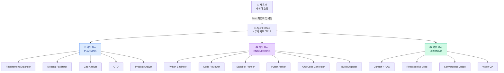
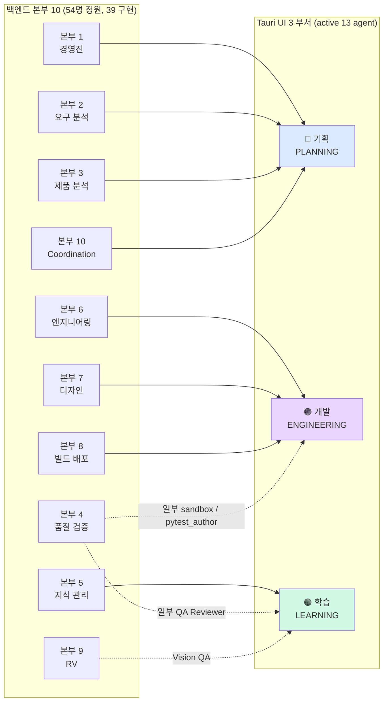

# 🏛️ Nexus Alpha — Agent Organization Chart (단일 진입점)

> **신설일**: 2026-05-19 (세션 진짜 마감 docs PR)
> **목적**: 본부 10 (Coordination/Communication 본부 포함) 의 백엔드 조직 구조 + Tauri 데스크탑 앱의 **3 부서 (기획/개발/학습)** UI 매핑을 *단일 문서* 로 통합.
>
> 기존 `Nexus_Alpha_조직도_v11.md` 가 *진화 기록 (v6 → v11)* 차원이라면, 본 문서는 *현재 상태 + UI 매핑* 의 진입점.

---

## 1. 두 차원 동시 표기

| 차원 | 내용 | 출처 |
|------|------|------|
| **백엔드 본부 10** | 54명 정원 (`Nexus_Alpha_조직도_v11.md`) — 경영진 + 실무 본부 10 (Coordination/Communication 본부 신설) | `docs/architecture/Nexus_Alpha_조직도_v11.md` |
| **Tauri UI 3 부서** ⭐ NEW | 🔵 기획 / 🟣 개발 / 🟢 학습 (`docs/insights/desktop_app_vision.md` §2) | `src/monitoring/telemetry.py` 의 `_NODE_DEPARTMENT` |

본 문서는 *두 차원의 매핑* 을 명시. UI 차원은 `iterative_loop` 의 9 노드 + 핵심 13 agent 의 active member 만 묶음 — *백엔드 본부 분류와 1:1 대응이 아님*.

---

## 2. Tauri UI 부서 매핑 (PR #188 Sprint 4 데이터 진실)

`src/monitoring/telemetry.py` 의 `_NODE_DEPARTMENT` 매핑이 *런타임 진실*. Tauri UI 가 본 매핑으로 부서별 카드 색상 결정.

### 부서 ↔ 노드 매핑 (`telemetry.department_for_node`)

| 부서 | 색상 | iterative_loop 노드 | Tauri UI 펄스 활성 시점 |
|------|------|---------------------|------------------------|
| 🔵 **PLANNING** | 파랑 | `expand_requirements`, `kickoff_meeting`, `analyze_gap`, `prepare_feedback` | 회의 / 분석 / feedback 작성 중 |
| 🟣 **ENGINEERING** | 보라 | `run_chain`, `run_sandbox` | 코드 작성 / 실행 중 |
| 🟢 **LEARNING** | 청록 | `recall_past_knowledge`, `judge_convergence`, `retrospective`, `retrospective_blocked`, `curate_knowledge`, `curate_knowledge_blocked` | 회고 / RAG / 결정표 중 |
| ⚪ **SYSTEM** | 회색 | `finalize`, `escalate`, *미매핑 fallback* | 종결 (펄스 OFF) |

---

## 3. 백엔드 본부 10 ↔ Tauri 3 부서 매핑

`Nexus_Alpha_조직도_v11.md` 의 *본부 10 + 54명* 정원이 Tauri 3 부서로 *압축* 되는 매핑.

### 매핑 원칙

1. **본부 1/2/3/10 → 🔵 기획** — 경영/분석/요구/소통 흐름
2. **본부 6/7/8 → 🟣 개발** — 코드/UI/빌드 흐름
3. **본부 5/9 + 본부 4 일부 → 🟢 학습** — 지식/검증/RV
4. **본부 4 (QA)** 는 *분할 매핑* — 산출물 검증 자체는 ENGINEERING (run_chain 안), retrospective/curate 는 LEARNING

---

## 4. 본 세션 진짜 마감 시점 active 13 agent (LLM 호출 주체)

`iterative_loop` 의 9 노드 + Track B 분기 + Build 분기에서 실제 LLM 호출이 발생하는 agent. PR #188 의 `BaseLLMProvider.generate()` finally 블록이 모두 `AgentMessageEvent` 로 캡처.

| # | Agent | 부서 | 본부 | 호출 위치 |
|---|-------|------|------|-----------|
| 1 | Requirement Expander | 🔵 기획 | 본부 2 | `_node_expand_requirements` |
| 2 | RAG Searcher (Curator 학습면) | 🟢 학습 | 본부 5 | `_node_recall_past_knowledge` |
| 3 | Meeting Facilitator | 🔵 기획 | 본부 10 | `_node_kickoff_meeting` |
| 4 | CTO | 🔵 기획 | 본부 1 | `_node_run_chain` 내부 |
| 5 | Product Analyst | 🔵 기획 | 본부 3 | `_node_run_chain` 내부 |
| 6 | Python Engineer | 🟣 개발 | 본부 6 | `_node_run_chain` 내부 |
| 7 | Code Reviewer | 🟣 개발 | 본부 4 (QA → UI상 개발) | `_node_run_chain` 내부 |
| 8 | Pytest Author | 🟣 개발 | 본부 4 | Track B / build 분기 |
| 9 | GUI Code Generator | 🟣 개발 | 본부 7 | enable_gui_branch |
| 10 | Gap Analyst | 🔵 기획 | 본부 4 | `_node_analyze_gap` |
| 11 | Retrospective Lead | 🟢 학습 | 본부 10 | `_node_retrospective` |
| 12 | Knowledge Curator | 🟢 학습 | 본부 5 → 본부 10 promoted | `_node_curate_knowledge` |
| 13 | Vision QA (옵션) | 🟢 학습 | 본부 9 (RV) | enable_build_branch + vision_qa |

---

## 5. 관련 문서

- [Nexus_Alpha_조직도_v11.md](Nexus_Alpha_조직도_v11.md) — 본부 10 진화 기록 (v6 → v11)
- [system_architecture.md](system_architecture.md) ⭐ NEW — 백엔드 + Telemetry + Tauri sidecar 흐름
- [phase_progress.md](phase_progress.md) ⭐ NEW — Phase 1~8 + Sprint 4~6 timeline
- [../insights/desktop_app_vision.md](../insights/desktop_app_vision.md) — Tauri 비전 + 부서 매핑 출처
- [../insights/agent_collaboration_paradigm_shift.md](../insights/agent_collaboration_paradigm_shift.md) — 통찰 6 north star
- `src/monitoring/telemetry.py` — `_NODE_DEPARTMENT` 런타임 진실

---

## 6. 변경 이력

| 일자 | 변경 |
|------|------|
| 2026-05-19 | 신설 — 본부 10 + Tauri 3 부서 매핑 단일 진입점. Sprint 4 Telemetry foundation 완료 후 첫 통합. |
