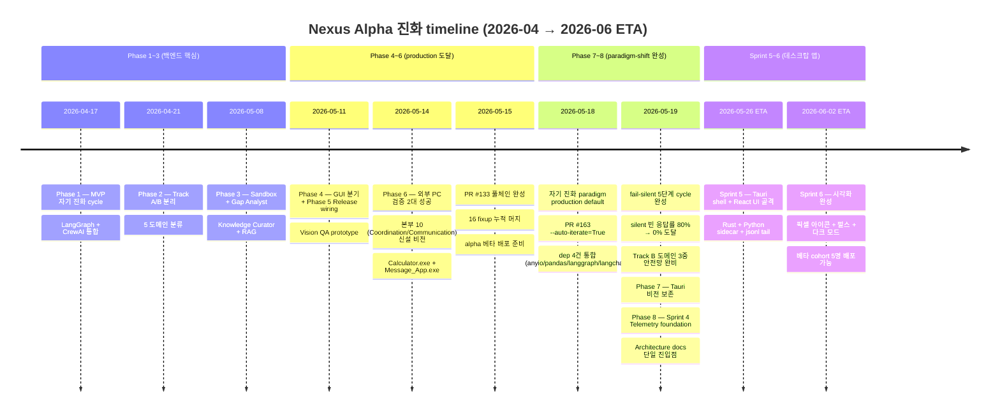
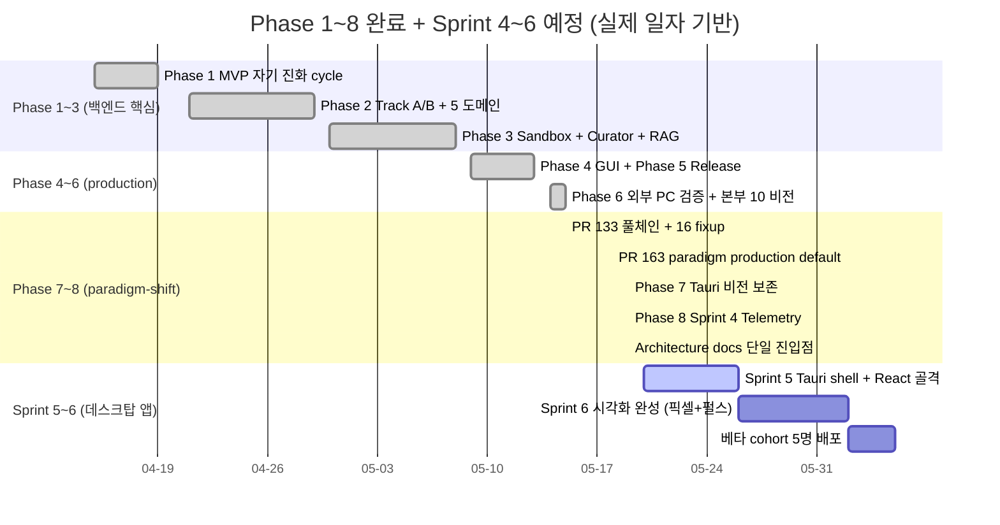
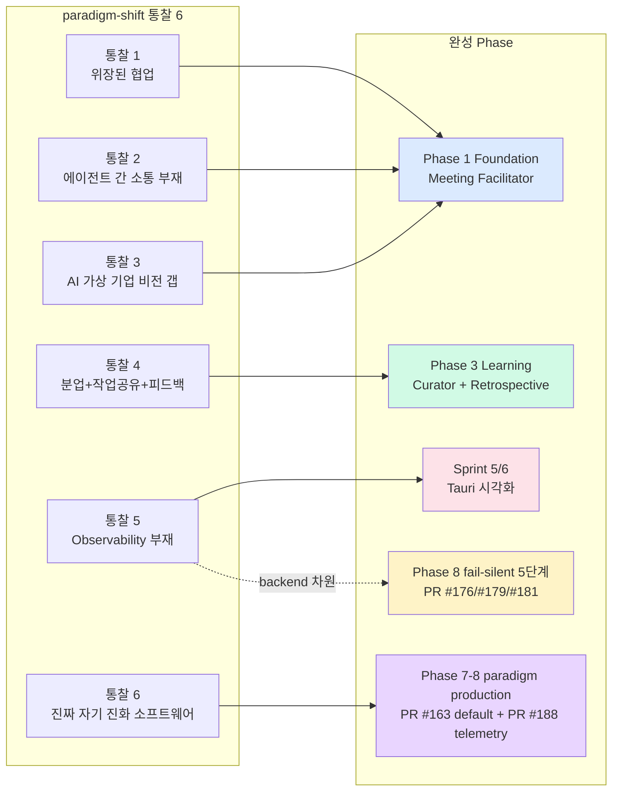
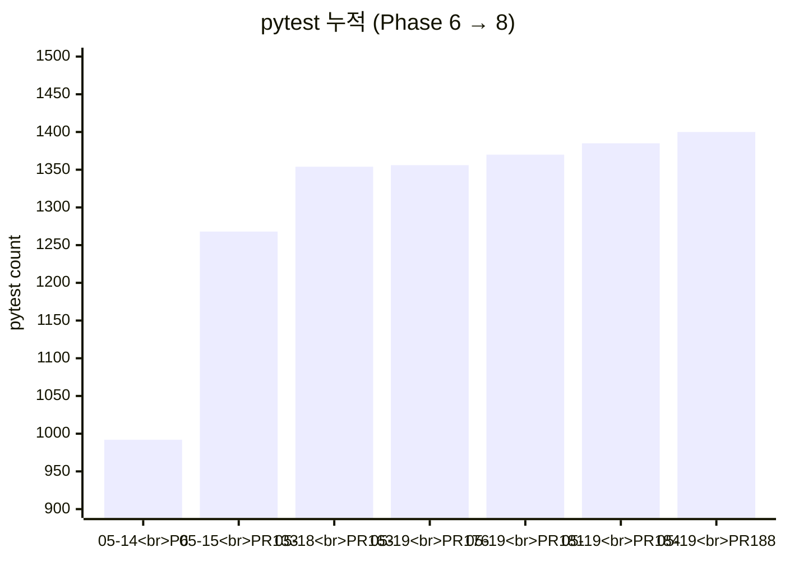

# 📈 Nexus Alpha — Phase Progress Timeline

> **신설일**: 2026-05-19 (세션 진짜 마감 docs PR)
> **목적**: Phase 1~8 *완료* + Sprint 4~6 *예정* 의 진화 timeline 을 단일 mermaid 다이어그램으로 시각화. 누가 *어디까지 왔고 어디로 가는지* 한눈에 파악.

---

## 1. Master Timeline (Phase 1 → Sprint 6)

---

## 2. Phase 별 상세 + 핵심 산출

---

## 3. 핵심 마일스톤 (절대 not-bypass 차원)

| 마일스톤 | 일자 | 의미 |
|---------|------|------|
| ✅ **외부 PC 빌드 성공 2대** | 2026-05-14 | "친구 PC에서 .exe 동작" — 단순 dev box 아닌 *baseline cohort 가능성* 증명 |
| ✅ **PR #133 풀체인 완성** | 2026-05-15 | 자연어 → .exe → Draft Release 풀체인 1회 통과 |
| ✅ **자기 진화 paradigm production default** | 2026-05-18 (PR #163) | `--auto-iterate=True` 기본 — 통찰 6 의 *production* 도달 |
| ✅ **fail-silent 5단계 cycle 완성** | 2026-05-19 | 식별 → 진단 → 보존 → 처방 → 검증 sprint 방법론 정립 |
| ✅ **silent 빈 응답률 0% 도달** | 2026-05-19 (PR #181 Phase 5) | retrospective_lead LLM 호출 80% → 0% (단일 line fix) |
| ✅ **Track B 도메인 3중 안전망** | 2026-05-19 (PR #184) | 휴리스틱 + graceful + CLI explicit |
| ✅ **Sprint 4 Telemetry foundation** | 2026-05-19 (GH PR #188, 내부 "PR #187") | 데스크탑 앱 prerequisite 완성 |
| 🔜 **Tauri shell 첫 동작** | ETA 2026-05-26 | 옵션: hello-world + Python sidecar + jsonl tail |
| 🔜 **베타 cohort 5명 배포** | ETA 2026-06-02 | 데스크탑 앱 .exe 5명 분배 (PowerShell 아닌) |

---

## 4. paradigm-shift 통찰 ↔ 진화 매핑

본인 비전 통찰 6 (north star) 의 각 통찰이 어느 Phase 에서 *완성* 됐는가:

- **통찰 5 (Observability 부재)** 가 *backend 차원* 은 fail-silent 5단계 cycle 로 처방 완료 (PR #181 0% 도달). *UI 차원* 은 Sprint 5/6 의 시각화로 완성 예정. 본 통찰이 *유일하게 두 차원* 에 걸침 — 데스크탑 앱이 *마지막 1m*.

---

## 5. pytest + PR 누적 graph

본 timeline 의 *결정적 evidence* — pytest **992 → 1400** (Phase 6 → 8), 8주 동안 +408 추가 + **회귀 0**.

---

## 6. 다음 결정 시점

| 시점 | 결정 | 의존성 | 가치 |
|------|------|--------|------|
| Sprint 5 진입 직전 | Tauri 프로젝트 scaffold 위치 (`src-tauri/` vs `frontend/`) | 본 architecture docs | 디렉터리 구조 *결정론* |
| Sprint 5 진행 중 | Python sidecar 동봉 vs 시스템 Python 의존 | 베타 cohort 환경 조사 | 배포 단순화 vs 크기 trade-off |
| Sprint 5 종료 | 베타 cohort 5명 ($250) 결정 | Tauri shell 동작 evidence | "데스크탑 앱 곧 도착" 가정으로 의미 |
| Sprint 6 진입 | 픽셀 아이콘 디자인 — 외주 vs AI 이미지 생성 | 비용 + 시간 trade-off | UI 완성도 |
| Sprint 6 종료 | 베타 cohort .exe 분배 + 피드백 수집 | Sprint 6 모두 완성 | 외부 검증 + 통찰 6 사실화 |

---

## 7. 관련 문서

- [agent_org_chart.md](agent_org_chart.md) ⭐ NEW — 본부 10 + 3 부서 매핑
- [system_architecture.md](system_architecture.md) ⭐ NEW — 백엔드 + Telemetry + Tauri 흐름
- [../insights/agent_collaboration_paradigm_shift.md](../insights/agent_collaboration_paradigm_shift.md) — 통찰 6 north star
- [../insights/desktop_app_vision.md](../insights/desktop_app_vision.md) — Sprint 5/6 비전
- [../progress/session_log_20260519.md](../progress/session_log_20260519.md) — 본 세션 12 PR 누적
- [../WORK_STATUS.md](../WORK_STATUS.md) — 다음 세션 첫 입력 가이드

---

## 8. 변경 이력

| 일자 | 변경 |
|------|------|
| 2026-05-19 | 신설 — Phase 1~8 완료 + Sprint 4~6 예정 mermaid timeline + 마일스톤 + pytest graph. |
