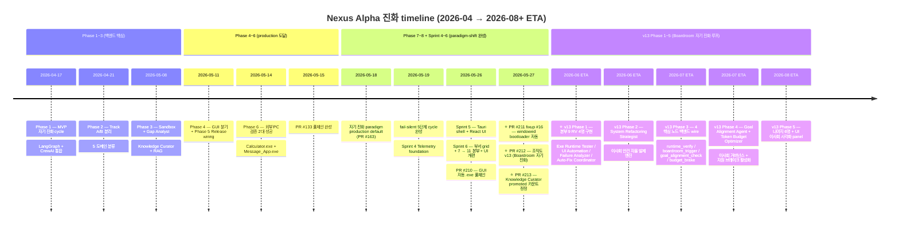
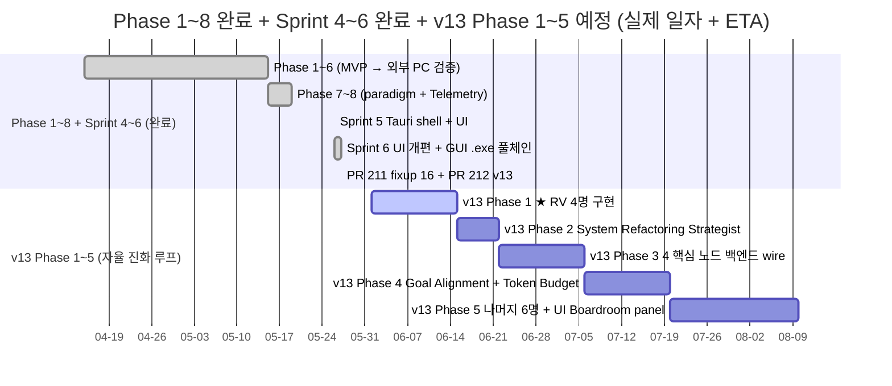
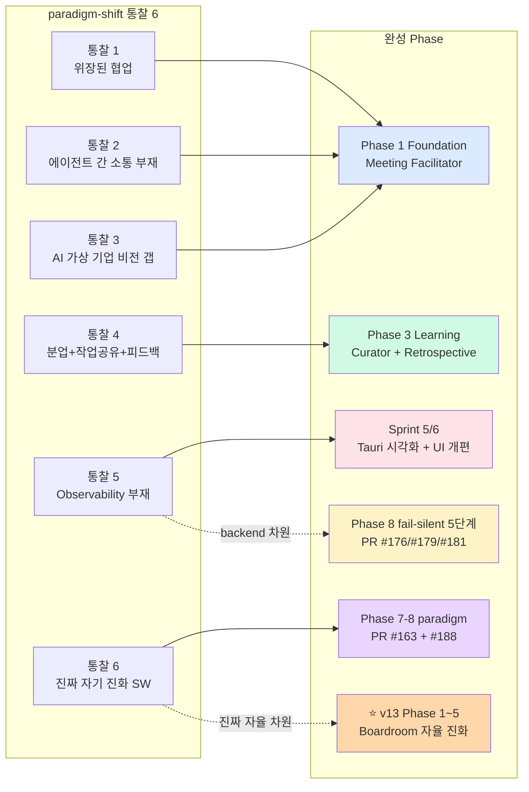
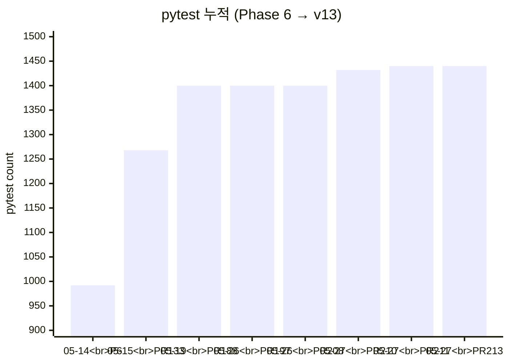

# 📈 Nexus Alpha — Phase Progress Timeline (v13 동기화)

> **갱신일**: 2026-05-27 (PR #213 머지 후 — Boardroom 자기 진화 패러다임 + 정원 52 + Phase 1~5 v13 우선순위)
> **목적**: Phase 1~8 *완료* + Sprint 4~6 *완료* + **v13 Phase 1~5 자율 진화 루프 예정** 의 진화 timeline 을 단일 mermaid 다이어그램으로 시각화.

---

## 1. Master Timeline (Phase 1 → v13 Phase 5)

---

## 2. v13 Phase 별 상세 + 핵심 산출

---

## 3. 핵심 마일스톤 (절대 not-bypass 차원 + v13 신규)

| 마일스톤 | 일자 | 의미 |
|---------|------|------|
| ✅ **외부 PC 빌드 성공 2대** | 2026-05-14 | "친구 PC 에서 .exe 동작" — baseline cohort 증명 |
| ✅ **PR #133 풀체인 완성** | 2026-05-15 | 자연어 → .exe → Draft Release 풀체인 1회 통과 |
| ✅ **자기 진화 paradigm production default** | 2026-05-18 (PR #163) | `--auto-iterate=True` 기본 |
| ✅ **fail-silent 5단계 cycle 완성** | 2026-05-19 | silent 빈 응답률 80% → 0% |
| ✅ **Sprint 4 Telemetry foundation** | 2026-05-19 (PR #188) | 데스크탑 앱 prerequisite |
| ✅ **Sprint 5 Tauri shell + React UI** | 2026-05-26 (PR #197) | 데스크탑 앱 골격 |
| ✅ **Sprint 6 UI 개편 (11 본부 grid)** | 2026-05-26~27 (PR #206/#208) | 부서 시각화 + 통계바/필터/패널 |
| ✅ **PR #210 GUI 자동 .exe 풀체인** | 2026-05-27 | 4회 BLOCKED 사고 처방 (AST + smoke test) |
| ✅ **PR #211 fixup #16 windowed** | 2026-05-27 | cmd 콘솔창 사고 처방 (--windowed 자동) |
| ✅ **PR #212 조직도 v13 (Boardroom 자기 진화)** | 2026-05-27 | 패러다임 재정의 (52명 정원) |
| ✅ **PR #213 Knowledge Curator promoted 정정** | 2026-05-27 | UI 통계 39/13 일치 |
| 🔜 **★ v13 Phase 1: RV 4명 구현** | ETA 2026-06-15 | **자율 진화 루프 *감지* 노드** |
| 🔜 v13 Phase 2: System Refactoring Strategist | ETA 2026-06-22 | 이사회 안건 자율 발제 엔진 |
| 🔜 v13 Phase 3: 4 핵심 노드 wire | ETA 2026-07-06 | `runtime_verify` / `boardroom_trigger` / `goal_alignment_check` / `budget_brake` |
| 🔜 v13 Phase 4: 이사회 의결권 + 브레이크 | ETA 2026-07-20 | Goal Alignment Agent + Token Budget Optimizer |
| 🔜 v13 Phase 5: 나머지 6명 + UI Boardroom panel | ETA 2026-08-10 | 자율 진화 루프 *완성도* |

---

## 4. paradigm-shift 통찰 ↔ 진화 매핑

본인 비전 통찰 6 (north star) 의 각 통찰이 어느 Phase 에서 *완성* 됐는가:

- **통찰 5 (Observability 부재)** 가 *backend 차원* 은 fail-silent 5단계 cycle 로 처방, *UI 차원* 은 Sprint 5/6 시각화로 완성.
- **통찰 6 (진짜 자기 진화 SW)** 가 *paradigm production default* 로 1차 진화, **v13 의 Boardroom 자율 진화 루프** 로 진정한 *자율* 차원 도달 예정.

---

## 5. v13 Phase 1~5 우선순위 상세

### Phase 1 (★ 최우선) — 본부 9 Runtime Verification 4명 구현

**책임**: Telemetry 자율 인지 인프라 확보. 자기 진화 루프의 *안테나*.

| 신설 agent | 역할 |
|-----------|------|
| Exe Runtime Tester | `.exe` sandbox 실행 검증 (시작 시간/exit/메모리) |
| UI Automation Specialist | PyAutoGUI/Playwright 사용자 시나리오 자동 수행 |
| Runtime Failure Analyzer | 실행 fail trace 분석 → actionable feedback |
| Auto-Fix Coordinator | RV failure 라우팅 + 재빌드 trigger |

**완료 조건**: `.exe` 실행 중 silent fail 시 RV agent 가 에러 trace 추출 → Telemetry 로그 append.

### Phase 2 — System Refactoring Strategist

**책임**: 이사회 안건 자율 *발제* 엔진. 런타임 + Telemetry 분석 → 개선안 작성.

**완료 조건**: silent fail 5회 연속 감지 시 *자율 발제* — "max_iterations 상향" / "GUI sandbox 강화" 등.

### Phase 3 — 4 핵심 노드 백엔드 구현

`iterative_loop.py` 또는 별도 *meta workflow* 에 추가:
- `runtime_verify` — 본부 9
- `boardroom_trigger` — 본부 10
- `goal_alignment_check` — 본부 0
- `budget_brake` — 본부 0

**완료 조건**: Phase 2 의 발제가 *boardroom_trigger* → *goal_alignment_check* → *budget_brake* 순으로 흐르고, 합의 시 *build_workflow* 자동 진입.

### Phase 4 — Goal Alignment Agent + Token Budget Optimizer 구현

**책임**: 이사회 거버넌스 + 자원 브레이크 *의결권*.

**완료 조건**: 발제된 개선안이 *목적 부합 검증* + *예산 한도 검증* 통과해야만 배포.

### Phase 5 — 나머지 6명 + UI Boardroom panel

- CEO/CFO 의 *비전 차원* 멤버 (Goal Alignment + Token Budget) 외 6명 (Product Manager / Documentation Lead / Monitoring Engineer / Mobile / Embedded / Cross-Agent Consultant) 순차 구현
- UI: Boardroom 토론 *실시간 시각화 panel* (현재 부재)

**완료 조건**: 사용자가 *이사회 토론 진행 상황* 을 UI 에서 실시간 관찰 가능 + 52/52 (100%) 구현률 도달.

---

## 6. pytest + PR 누적 graph

본 timeline 의 *결정적 evidence* — pytest **992 → 1440** (Phase 6 → v13), **회귀 0**.

---

## 7. 다음 결정 시점

| 시점 | 결정 | 가치 |
|------|------|------|
| **v13 Phase 1 진입 직전** | RV 4명 *모두* 동시 진행 vs Exe Runtime Tester 만 first | Phase 1 ROI 결정 |
| v13 Phase 2 종료 | System Refactoring Strategist 의 *안건 발제 정확도* 검증 | Phase 3 진입 결정 |
| v13 Phase 4 종료 | Goal Alignment + Token Budget 의결권 활성화 시점 | 이사회 자율성 결정 |
| v13 Phase 5 종료 | Boardroom UI panel — 사용자 *관찰* 만 vs *개입* 가능 | UX 완성도 결정 |
| v13 100% 완료 후 | 베타 cohort 5명 ($250) 배포 — 자율 진화 SW 의 *실 라이브 검증* | 외부 검증 |

---

## 8. 관련 문서

- ⭐ [Nexus_Alpha_조직도_v13.md](Nexus_Alpha_조직도_v13.md) — 단일 진실 공급원
- [Nexus_Alpha_구성안_v8.md](Nexus_Alpha_구성안_v8.md) — v8 패러다임 (Boardroom)
- [agent_org_chart.md](agent_org_chart.md) — 본부 10 + 3 부서 매핑
- [system_architecture.md](system_architecture.md) — 백엔드 + Telemetry + Tauri + v13 신규 노드
- [../insights/agent_collaboration_paradigm_shift.md](../insights/agent_collaboration_paradigm_shift.md) — 통찰 6 north star
- [../insights/desktop_app_vision.md](../insights/desktop_app_vision.md) — Sprint 5/6 비전 (완료)
- [../WORK_STATUS.md](../WORK_STATUS.md) — 다음 세션 첫 입력 + v13 Phase 작업 순서

---

## 9. 변경 이력

| 일자 | 변경 |
|------|------|
| 2026-05-19 | 신설 — Phase 1~8 완료 + Sprint 4~6 예정 mermaid timeline + 마일스톤 + pytest graph |
| **2026-05-27** | ⭐ **v13 동기화 — Sprint 4~6 완료 표기 + v13 Phase 1~5 (RV 최우선) 추가 + 레거시 행정 직책 일정 소거 + Mermaid timeline v13 entry 추가** |
