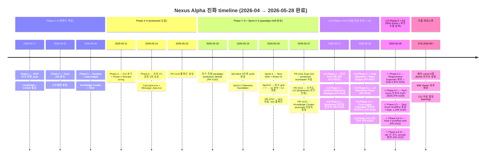
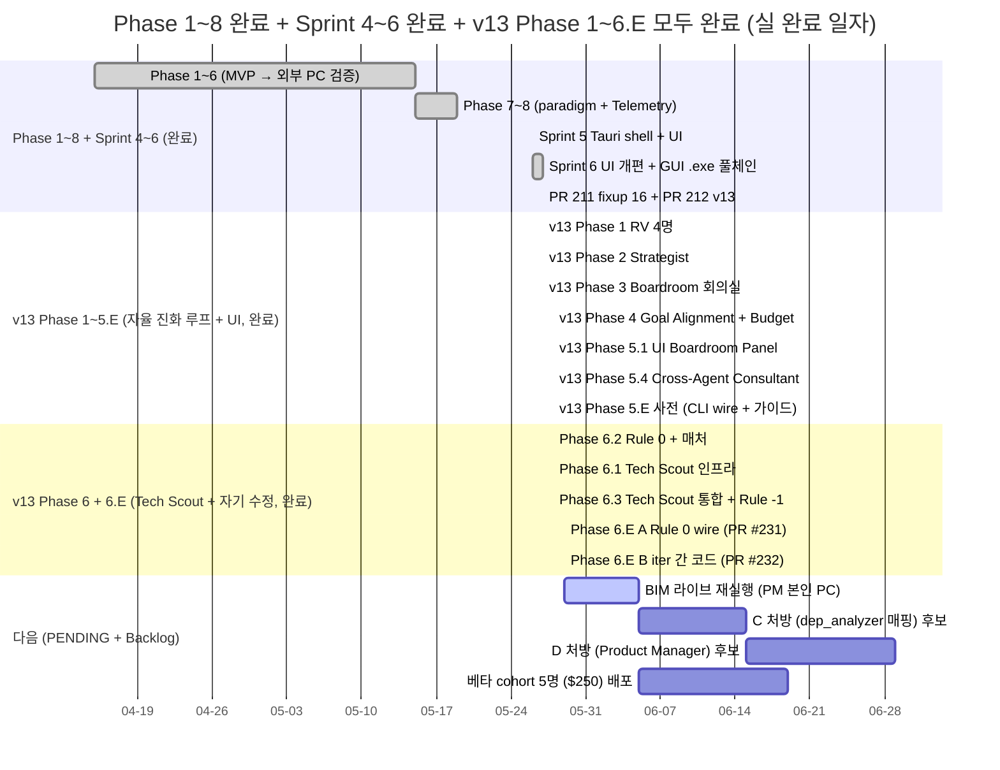
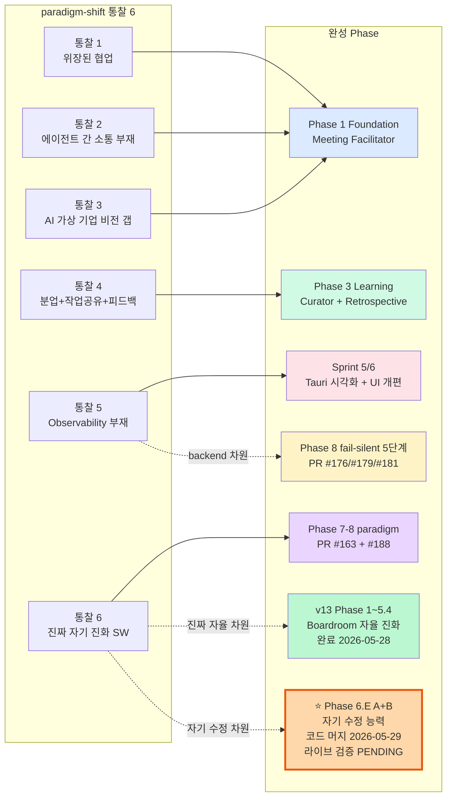
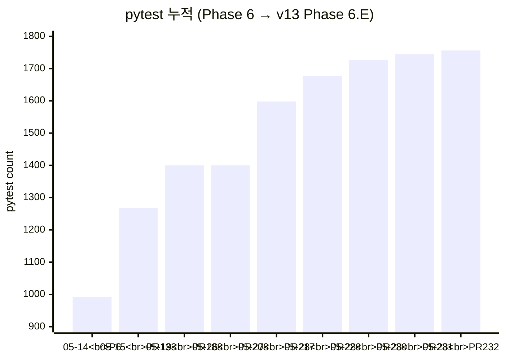

# 📈 Nexus Alpha — Phase Progress Timeline (v13 동기화)

> **갱신일**: 2026-05-29 (재실행 크래시 — Phase 6.E A+B **코드 머지 완료, 라이브 미검증**. 재실행이 GraphRecursionError 로 크래시, 근본원인 = **Rule 0 우선순위 버그**(종료조건 override 회귀, PR #231))
> **목적**: Phase 1~8 *완료* + Sprint 4~6 *완료* + **v13 Phase 1~6 + 6.E A+B 코드 머지 완료 (라이브 미검증 — 재실행 크래시)** 의 진화 timeline 을 단일 mermaid 다이어그램으로 시각화. 다음 단계 = **P0 회귀 수정 PR**(Rule 0 우선순위 + 라우터 iteration 가드 + 회귀 테스트) → 재실행.

---

## 1. Master Timeline (Phase 1 → v13 Phase 6.E)

---

## 2. Phase 별 상세 + 핵심 산출 (Gantt — 모두 완료)

---

## 3. 핵심 마일스톤 (전체 진화)

| 마일스톤 | 일자 | 의미 |
|---------|------|------|
| ✅ **외부 PC 빌드 성공 2대** | 2026-05-14 | "친구 PC 에서 .exe 동작" — baseline cohort 증명 |
| ✅ **PR #133 풀체인 완성** | 2026-05-15 | 자연어 → .exe → Draft Release 풀체인 1회 통과 |
| ✅ **자기 진화 paradigm production default** | 2026-05-18 (PR #163) | `--auto-iterate=True` 기본 |
| ✅ **fail-silent 5단계 cycle 완성** | 2026-05-19 | silent 빈 응답률 80% → 0% |
| ✅ **Sprint 4 Telemetry foundation** | 2026-05-19 (PR #188) | 데스크탑 앱 prerequisite |
| ✅ **Sprint 5 Tauri shell + React UI** | 2026-05-26 (PR #197) | 데스크탑 앱 골격 |
| ✅ **Sprint 6 UI 개편 (11 본부 grid)** | 2026-05-26~27 (PR #206/#208) | 부서 시각화 + 통계바/필터/패널 |
| ✅ **PR #210 GUI 자동 .exe 풀체인** | 2026-05-27 | 4회 BLOCKED 사고 처방 (AST + smoke test) |
| ✅ **PR #211 fixup #16 windowed** | 2026-05-27 | cmd 콘솔창 사고 처방 (--windowed 자동) |
| ✅ **PR #212 조직도 v13 (Boardroom 자기 진화)** | 2026-05-27 | 패러다임 재정의 (52명 정원) |
| ✅ **v13 Phase 1: RV 4명 구현** | 2026-05-27 (PR #217/#218) | 자율 진화 루프 *감지* 노드 |
| ✅ **v13 Phase 2: System Refactoring Strategist** | 2026-05-27 (PR #219) | 이사회 안건 자율 발제 엔진 |
| ✅ **v13 Phase 3: Boardroom 회의실 인프라** | 2026-05-27 (PR #221) | `boardroom_trigger` + Facilitator 격상 |
| ✅ **v13 Phase 4: Goal Alignment + Token Budget** | 2026-05-28 (PR #222) | 이사회 의결권 활성화 + decision.yaml |
| ✅ **v13 Phase 5.1: UI Boardroom Panel** | 2026-05-28 (PR #223) | 3-pane viewer (decision.yaml 가시화) |
| ✅ **v13 Phase 5.4: 양방향 티키타카** | 2026-05-28 (PR #224) | Cross-Agent Consultant + 3 라운드 sequence + schema v2 |
| ✅ **v13 Phase 5.E 사전 준비** | 2026-05-28 (PR #225) | `--enable-tikitaka` wire + 라이브 가이드 |
| ✅ **v13 UI 부서 대표 시각 구별** | 2026-05-28 (PR #228) | 👑 + 금색 테두리 (14명) |
| ✅ **v13 Phase 6.2: Requirement Expander 3D 매처 + Rule 0** | 2026-05-28 (PR #226) | 얕은 분석 결함 처방 (BIM 본질) |
| ✅ **v13 LLM_PROVIDER 호환성 리포트** | 2026-05-28 (PR #227) | Phase 6.1 진입 신호등 GREEN |
| ✅ **v13 Phase 6.1: Tech Scout 인프라** | 2026-05-28 (PR #229) | PyPI JSON + 7d TTL 캐싱 + MAX_SEARCHES=5 |
| ✅ **v13 Phase 6.3: Tech Scout 통합 + Rule -1** | 2026-05-28 (PR #230) | `--enable-tech-scout` + 가짜 1차 IMPROVE / 2차 BLOCKED |
| ⭐ **v13 Phase 6.E A: Rule 0 workflow wire** | **2026-05-29 (PR #231)** | **Rule 0 wire 코드 머지** (PR #226 wire 갭 해소) — 라이브 미검증 |
| ⭐ **v13 Phase 6.E B: iter 간 코드 prompt 첨부** | **2026-05-29 (PR #232)** | **Engineer 가 *직전 iter 산출* 인지 → blank slate 재시작 차단 (코드 머지)** — 라이브 미검증 |
| 🛠 **"에이전트 자기 수정 능력 강화" A+B 코드 머지** | **2026-05-29 (A+B 결합)** | **PR #231 + #232 — 두 root cause 코드 처방 (라이브 실증 PENDING)** |
| 💥 **A+B 재실행 크래시 (GraphRecursionError)** | 2026-05-29 | 근본원인 = Rule 0 종료조건 override 회귀(PR #231) → 루프 7회 폭주 → recursion 초과. A·B 둘 다 발동했으나 A가 비종료 유발, B는 PyQt 드리프트 고착. [크래시 분석](../diagnostics/phase6e_rerun_crash_analysis_20260529.md) |
| 🔧 **P0 회귀 수정 (1순위)** | NEXT | Rule 0가 ITERATION_CAP override 못 하게 + 라우터 iteration 가드 + 회귀 테스트 → 그 후 P1(플랫폼 드리프트 가드레일) → 재실행 |
| 🔜 **베타 cohort 5명 라이브 검증** | ETA 2026-06+ | (재실행 PASS 후) 자율 진화 SW + BIM Viewer 외부 사용자 evidence |

---

## 4. paradigm-shift 통찰 ↔ 진화 매핑

본인 비전 통찰 6 (north star) 의 각 통찰이 어느 Phase 에서 *완성* 됐는가:

- **통찰 5 (Observability 부재)** 가 *backend 차원* 은 fail-silent 5단계 cycle 로 처방, *UI 차원* 은 Sprint 5/6 시각화로 완성.
- **통찰 6 (진짜 자기 진화 SW)** 가 *paradigm production default* 로 1차 진화, **v13 의 Boardroom 자율 진화 루프** 로 *자율 차원* 도달 (2026-05-28 완료), **Phase 6.E A+B** 로 *자기 수정 차원* 의 **코드 처방 머지 완료 (2026-05-29, 라이브 검증 PENDING — 재실행 verdict 대기)**.

---

## 5. v13 Phase 별 완료 상세

### Phase 1 (PR #217/#218) — 본부 9 Runtime Verification 4명 ✅
- Exe Runtime Tester / UI Automation Specialist / Runtime Failure Analyzer / Auto-Fix Coordinator
- 자기 진화 루프의 *안테나* — Telemetry 자율 인지 인프라

### Phase 2 (PR #219) — System Refactoring Strategist ✅
- silent fail 5회 연속 감지 시 자율 안건 발제

### Phase 3 (PR #221) — Boardroom 회의실 인프라 ✅
- `boardroom_trigger` 노드 + Placeholder 2 nodes + Facilitator 격상

### Phase 4 (PR #222) — 본부 0 의결권 활성화 ✅
- Goal Alignment Agent + Token Budget Optimizer
- decision.yaml schema v1 자동 작성

### Phase 5.1 (PR #223) — UI Boardroom Panel ✅
- 3-pane (세션 list + decision viewer + 회의록 markdown)

### Phase 5.4 (PR #224) — Cross-Agent Consultant 양방향 티키타카 ✅
- 3 라운드 sequence (proposer → reviewer → dissenter → mediator)
- decision.yaml schema v1 → v2 (rounds[] + consensus)

### Phase 5.E 사전 (PR #225) — 라이브 검증 wire + 가이드 ✅

### Phase 6.2 (PR #226) — Requirement Expander 3D 매처 + Convergence Judge Rule 0 ✅

### Phase 6.1 (PR #229) — Tech Scout 인프라 (PyPI JSON) ✅

### Phase 6.3 (PR #230) — Tech Scout workflow 통합 + Rule -1 ✅
- `--enable-tech-scout` CLI + 가짜 패키지 1차 IMPROVE / 2차 BLOCKED 절충안

### ⭐ Phase 6.E A (PR #231) — Rule 0 workflow wire ✅
- PR #226 의 build_domain_checklist 가 *드디어* 프로덕션에서 작동
- `_node_expand_requirements` 가 1회 호출 + state 보존
- `_node_judge_convergence` 가 domain_checklist + engineer_output_excerpt + qa_result_excerpt 전달
- 진단 리포트 + backlog (C/D) 보존

### ⭐ Phase 6.E B (PR #232) — iter 간 코드 컨텍스트 prompt 첨부 ✅
- `_node_run_chain` 이 iter 2+ 진입 시 *이전 iter 코드 발췌* 자동 첨부
- Engineer 가 *직전 산출* 인지 → blank slate 재시작 차단
- "기존 구조/식별자 최대한 유지, 백지 재시작 = 퇴행" 안내

---

## 6. pytest + PR 누적 graph

본 timeline 의 *결정적 evidence* — pytest **992 → 1756** (Phase 6 → v13 Phase 6.E), **회귀 0** (전체 진화).

---

## 7. 다음 결정 시점 (PENDING + Backlog)

| 시점 | 결정 | 가치 |
|------|------|------|
| ⭐ **BIM 라이브 재실행 (PM 본인 PC) 직후** | **A+B 결합 효과 PASS/FAIL** → 다음 sprint 분기 (베타 / C / D) | Phase 6.E 마일스톤의 *실 evidence* — 가장 중요 |
| 베타 cohort 5명 결정 | $250 budget 배분 + IFC 샘플 안내 + BIM Viewer 패키징 | 외부 사용자 evidence |
| C 처방 진입 조건 | dep_analyzer 매핑 — BIM 같은 BUILD_FAILED 재발 시 | 환경 결함 차단 |
| D 처방 진입 조건 | Product Manager 에이전트 — 비전 일관성 갭 추가 식별 시 | 추가 안전망 |
| Tauri UI 토글 추가 | enable_tech_scout / tikitaka / boardroom 시각 토글 | UX 완성도 |

---

## 8. 관련 문서

- ⭐ [Nexus_Alpha_조직도_v13.md](Nexus_Alpha_조직도_v13.md) — 단일 진실 공급원
- [Nexus_Alpha_구성안_v8.md](Nexus_Alpha_구성안_v8.md) — v8 패러다임 (Boardroom)
- [agent_org_chart.md](agent_org_chart.md) — 본부 10 + 3 부서 매핑
- [system_architecture.md](system_architecture.md) — 백엔드 + Telemetry + Tauri + v13 노드
- [phase6_proposal.md](phase6_proposal.md) — Phase 6 제안서 (PM 확정 7건)
- [../diagnostics/phase6e_iteration_regression_diagnosis.md](../diagnostics/phase6e_iteration_regression_diagnosis.md) — BIM 퇴행 진단
- [../backlog/phase6e_followups.md](../backlog/phase6e_followups.md) — C/D 보류
- [../insights/agent_collaboration_paradigm_shift.md](../insights/agent_collaboration_paradigm_shift.md) — 통찰 6 north star
- [../insights/desktop_app_vision.md](../insights/desktop_app_vision.md) — Sprint 5/6 비전 (완료)
- [../WORK_STATUS.md](../WORK_STATUS.md) — 머지 사이클 + 첫 입력 가이드
- [../next_session_context.md](../next_session_context.md) — 다음 세션 핸드오프
- [../PHASE_6_LIVE_VERIFICATION_GUIDE.md](../PHASE_6_LIVE_VERIFICATION_GUIDE.md) — BIM 라이브 재실행 명령

---

## 9. 변경 이력

| 일자 | 변경 |
|------|------|
| 2026-05-19 | 신설 — Phase 1~8 완료 + Sprint 4~6 예정 mermaid timeline + 마일스톤 + pytest graph |
| 2026-05-27 | v13 동기화 — Sprint 4~6 완료 표기 + v13 Phase 1~5 (RV 최우선) 추가 + 레거시 행정 직책 일정 소거 |
| **2026-05-28** | ⭐ **v13 Phase 1~6.E 모두 완료 반영 — A+B 마일스톤 ("에이전트 자기 수정 능력 강화") + Phase 6.2/6.1/6.3/6.E A/B 5건 추가 + pytest 1756 + 다음 마일스톤 = 베타 cohort 라이브 검증** |
| **2026-05-29** | 🔧 **머지 날짜·검증 상태 정정 — #231/#232 머지일 2026-05-28 → 2026-05-29 (git 실측 09:22/09:35), "A+B 마일스톤 완성/도달" → "코드 머지 완료, 라이브 검증 PENDING" 조정. 1차 런(2026-05-28)은 A+B 머지 前 실행으로 INVALID 확정 (verdict 리포트). 다음 마일스톤 = A+B 라이브 재실행 verdict (1순위) 추가** |
| **2026-05-29** | 💥 **재실행 크래시 분석 반영 — A+B 머지된 main 재실행이 GraphRecursionError 로 크래시. 근본원인 = Rule 0 종료조건 override 회귀(PR #231, Rule 0 가 Rule 2 STAGNATION·Rule 4 ITERATION_CAP 보다 먼저 return → 종료 dead code → max_iter 무력화). recursion_limit=50 은 증상. 다음 마일스톤 = P0 회귀 수정 ([크래시 분석](../diagnostics/phase6e_rerun_crash_analysis_20260529.md))** |
