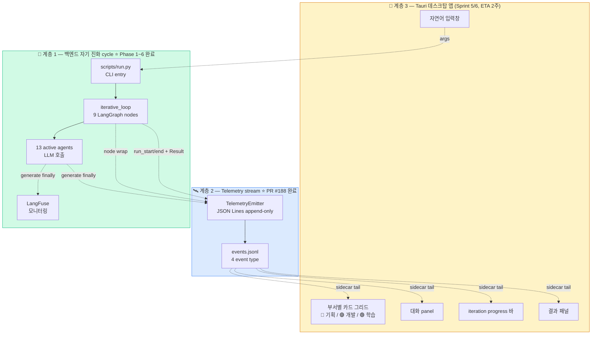
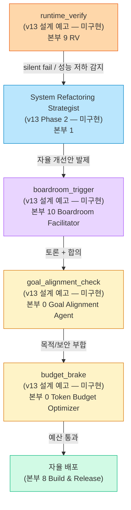
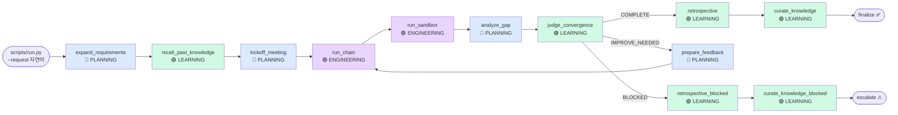
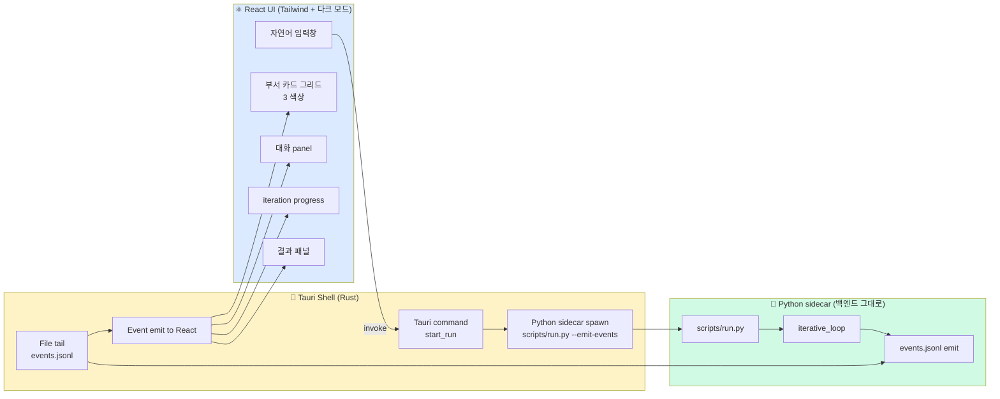

# 🏗️ Nexus Alpha — System Architecture (백엔드 + Telemetry + Tauri sidecar) — v13 동기화

> **신설일**: 2026-05-19 (세션 진짜 마감 docs PR)
> **v13 갱신일**: **2026-05-27** (PR #213 직후 — Boardroom 자기 진화 4 신규 노드 명세 추가)
> **목적**: 백엔드 (자기 진화 cycle) + Telemetry (PR #188 Sprint 4) + Tauri 데스크탑 앱 (Sprint 5/6) 의 *3 계층 데이터 흐름* + **v13 Boardroom 자율 진화 루프 4 신규 노드 (미구현)** 를 단일 문서로 통합.
>
> 본 문서는 *현재 상태 + 데스크탑 앱 진입 경로 + v13 자율 진화 루프 설계 예고* 의 진입점. 백엔드 코드 변경 없이 Tauri sidecar 가 jsonl tail 만으로 UI 갱신 가능한 *비침습 통합 설계* 핵심.

## ⚠ v13 신규 노드 — 모두 "(v13 설계 예고 — 미구현)" 상태

| 노드 | 책임 본부 | 상태 |
|------|----------|------|
| `runtime_verify` | 본부 9 RV (Phase 1순위 ★) | **(v13 설계 예고 — 미구현)** |
| `boardroom_trigger` | 본부 10 (Boardroom Facilitator) | **(v13 설계 예고 — 미구현)** |
| `goal_alignment_check` | 본부 0 (Goal Alignment Agent) | **(v13 설계 예고 — 미구현)** |
| `budget_brake` | 본부 0 (Token Budget Optimizer) | **(v13 설계 예고 — 미구현)** |

→ 본 4 노드는 *현재 백엔드 코드에 부재*. v13 Phase 1~4 진행으로 점진 구현. 본 문서 §2 계층 1 + §3 계층 2 에 *설계 명세* 만 기록.

---

## 1. 3 계층 개요



### 계층별 책임

| 계층 | 책임 | 상태 | 코드 |
|------|------|------|------|
| **1. 백엔드** | 자기 진화 cycle (recall → kickoff → chain → sandbox → gap → judge → retrospective → curate). LLM 호출 + 사람이 검토할 산출 file 생성. | ✅ Phase 1~6 + 자기 진화 paradigm production default | `scripts/run.py`, `src/workflows/iterative_loop.py`, `src/agents/**` |
| **1.5 — v13 Boardroom 자율 진화 루프** ⭐ | Telemetry 감지 → 안건 발제 → 이사회 토론 → 의결 → 자율 배포의 *메타 cycle*. 4 신규 노드 (runtime_verify / boardroom_trigger / goal_alignment_check / budget_brake) | **(v13 설계 예고 — 미구현)** | 백엔드 부재 — v13 Phase 1~4 진행 시 신설 예정 |
| **2. Telemetry** | 4 event type 을 JSON Lines 로 append. **default OFF** — env var 또는 CLI flag 활성. 기존 백엔드 코드 0 수정. | ✅ Sprint 4 foundation (GH PR #188) | `src/monitoring/telemetry.py` |
| **2.5 — v13 신규 Telemetry 부서** ⭐ | RV 자율 인지 emit + C-Level 의결권 emit. `_NODE_DEPARTMENT` 에 `rv` / `c-level` 키 추가 예정 | **(v13 설계 예고 — 미구현)** | `src/monitoring/telemetry.py` 갱신 예정 |
| **3. Tauri 데스크탑 앱** | Rust shell + React UI. Python sidecar spawn + jsonl tail + 부서 그리드 / 대화 panel / iteration progress / 결과 패널. | ✅ Sprint 5/6 완료 (PR #197 / #206 / #208) | `src-tauri/`, `frontend/src/App.tsx` |
| **3.5 — v13 UI Boardroom panel** ⭐ | 이사회 토론 *실시간 시각화* — agent 간 티키타카 메시지 + 의결권 결과 | **(v13 Phase 5 예정 — 미구현)** | `frontend/src/App.tsx` 갱신 예정 |

---

## 2. 백엔드 자기 진화 cycle (계층 1) + v13 Boardroom 루프 (계층 1.5 — 미구현)

`src/workflows/iterative_loop.py` 의 9 노드 + 2 alias = 13 add_node. PR #188 의 `_telemetry_wrap` 이 일괄 wrap.

### v13 자율 진화 루프 — 4 신규 노드 (미구현)

기존 iterative_loop (요청 처리 cycle) 과 *별도* 의 *메타 cycle*. v13 Phase 3 에서 신설 예정:



→ 4 신규 노드 (`runtime_verify` / `boardroom_trigger` / `goal_alignment_check` / `budget_brake`) 모두 **백엔드 코드 부재**. v13 Phase 3 에서 신설 예정.

### 기존 cycle (계층 1, 구현 완료)



### 핵심 특징 (Phase 1~6 production-ready)

- **자기 진화 paradigm production default** — PR #163 (2026-05-18) `--auto-iterate=True` 기본
- **fail-silent 5단계 cycle 완성** — 식별 → 진단 → 보존 → 처방 → 라이브 검증 (PR #176/#179/#181/Phase 5)
- **Track B 3중 안전망** — 휴리스틱 + graceful fallback + CLI `--forced-domain` (PR #172 + #184)
- **silent 빈 응답률 80% → 0% 도달** — PR #181 (`PYTEST_CURRENT_TEST` env var robust 검출)

---

## 3. Telemetry stream (계층 2, PR #188 ⭐)

`src/monitoring/telemetry.py` 의 `TelemetryEmitter` 싱글톤이 4 event type 을 JSON Lines 로 emit.

```mermaid
sequenceDiagram
    participant Run as scripts/run.py
    participant Env as NEXUS_TELEMETRY_PATH
    participant Emit as TelemetryEmitter
    participant Loop as run_iterative_loop
    participant Node as _telemetry_wrap(node)
    participant LLM as BaseLLMProvider.generate
    participant File as events.jsonl

    Run->>Env: --emit-events <path> → env var set
    Run->>Loop: run_iterative_loop(...)
    Loop->>Emit: begin_run(max_iterations)
    Loop->>File: IterationProgressEvent(run_start)

    loop 매 노드
        Loop->>Node: invoke(state)
        Node->>File: AgentStatusEvent(working, dept)
        Node->>LLM: agent.generate(prompt)
        LLM->>File: AgentMessageEvent(role=llm_call)
        Note over LLM: BaseLLMProvider.generate<br/>finally 블록 emit
        LLM-->>Node: output
        Node->>File: AgentStatusEvent(done, dept)
    end

    Loop->>File: ResultEvent(verdict, exe_path, duration)
    Loop->>File: IterationProgressEvent(run_end)
    Loop->>Emit: end_run()
```

### 4 Event Type

| Event | type 필드 | 빈도 | UI 용도 |
|-------|----------|------|---------|
| `AgentStatusEvent` | `agent_status` | 매 노드 진입/종료 (× 9~21 per iteration) | 부서 카드 펄스 토글 |
| `AgentMessageEvent` | `agent_message` | 매 LLM 호출 (× 5~10 per iteration) | 대화 panel append |
| `IterationProgressEvent` | `iteration_progress` | run_start / run_end (현재 2회), 향후 iter boundary 확장 (Sprint 5 폴리싱) | progress 바 |
| `ResultEvent` | `result` | run 종료 1회 | 결과 패널 |

### 활성화 방식 (default OFF — 기존 사용자 영향 0)

```powershell
# 옵션 A — CLI flag
.venv\Scripts\python.exe scripts\run.py --request "..." --emit-events events.jsonl --non-interactive

# 옵션 B — env var
$env:NEXUS_TELEMETRY_PATH = "C:\path\to\events.jsonl"
.venv\Scripts\python.exe scripts\run.py --request "..." --non-interactive

# 옵션 C — Tauri sidecar (Sprint 5)
# Rust shell 이 PathBuf 로 path 생성 + Python sidecar spawn 시 --emit-events 전달
```

---

## 4. Tauri 데스크탑 앱 통합 (계층 3, Sprint 5/6 ETA 2주)

본 계층은 *Sprint 5 진입 전* 상태. 본 문서 → Sprint 5 첫 작업의 *계약* 차원.



### Event 라우팅 (계약)

| 백엔드 event | Tauri command 라우팅 | React state update |
|--------------|---------------------|-------------------|
| `AgentStatusEvent.working` | `agent.workingStarted` | 카드 펄스 ON + 부서 색상 강조 |
| `AgentStatusEvent.done` | `agent.workingDone` | 카드 펄스 OFF |
| `AgentStatusEvent.error` | `agent.errored` | 카드 빨강 + detail surface |
| `AgentMessageEvent` | `chat.messageAppended` | 대화 panel 한 줄 append (240자 preview) |
| `IterationProgressEvent.run_start` | `run.started` | iteration progress 0/N 표시 |
| `IterationProgressEvent.run_end` | `run.ended` | progress 완료 상태 |
| `ResultEvent` | `result.received` | 결과 패널 verdict + .exe 다운로드 버튼 |

---

## 5. 의존성 + 비용 (계층별)

| 계층 | 의존성 | 추가 패키지 | 디스크 | 메모리 (idle) |
|------|--------|-------------|--------|---------------|
| 1. 백엔드 | Python 3.13 + CrewAI 1.14.1 + LangGraph + Anthropic SDK + Claude Code | 기존 `requirements.txt` (변경 0) | ~500 MB (.venv) | ~50 MB |
| 2. Telemetry | 표준 `json` + `pathlib` + `threading` (Python 내장만) | **0** (PR #188 신규 의존성 0) | <1 KB (events.jsonl 줄당 ~500B) | <1 MB |
| 3. Tauri 데스크탑 앱 | Rust 1.75+ + Tauri 2.x + Node 20+ (개발) / *런타임 Node 불필요* | Tauri + React + Tailwind | ~10 MB (.exe) | ~50 MB |

총 배포 크기 (Sprint 6 완료 시점): **~510 MB** (백엔드 venv + 데스크탑 앱 10 MB).
사용자 다운로드 시점 (Sprint 6): Tauri .exe 10 MB + Python 환경 설치 안내 (또는 PyInstaller 동봉).

---

## 6. 진화 경로 (Phase ↔ Sprint)

| 단계 | 작업 | 완료 일자 | PR |
|------|------|----------|-----|
| Phase 1~6 | 자기 진화 cycle production-ready | 2026-04~05 | PR #1~#163 |
| Phase 7 | 데스크탑 앱 비전 보존 | 2026-05-19 | docs/insights/desktop_app_vision.md |
| **Phase 8** ⭐ | **Sprint 4 Telemetry foundation** | **2026-05-19** | **GH PR #188 (내부 "PR #187")** |
| Sprint 5 | Tauri shell + React UI 골격 | 🔜 ETA ~1주 | (예정) |
| Sprint 6 | 시각화 완성 (픽셀 아이콘 + 펄스 + 다크 모드) | 🔜 ETA ~1주 | (예정) |

---

## 7. 관련 문서

- [agent_org_chart.md](agent_org_chart.md) ⭐ NEW — 본부 10 + 3 부서 매핑
- [phase_progress.md](phase_progress.md) ⭐ NEW — Phase 1~8 + Sprint 4~6 timeline
- [../insights/desktop_app_vision.md](../insights/desktop_app_vision.md) — Tauri UI 비전 + 부서 매핑 출처
- [../insights/agent_collaboration_paradigm_shift.md](../insights/agent_collaboration_paradigm_shift.md) — 통찰 6 north star
- [../progress/session_log_20260519.md](../progress/session_log_20260519.md) — PR #188 Phase 8 세션 로그
- `src/monitoring/telemetry.py` — TelemetryEmitter 런타임 진실
- `src/workflows/iterative_loop.py` — `_telemetry_wrap` + 13 add_node

---

## 8. 변경 이력

| 일자 | 변경 |
|------|------|
| 2026-05-19 | 신설 — 3 계층 (백엔드 / Telemetry / Tauri) 통합 진입점. Sprint 4 완료 + Sprint 5/6 계약 차원. |
| **2026-05-27** | ⭐ **v13 동기화 — 계층 1.5 (Boardroom 자율 진화 루프) + 계층 2.5 (rv/c-level telemetry 부서) + 계층 3.5 (UI Boardroom panel) 추가. 4 신규 노드 모두 "(v13 설계 예고 — 미구현)" 명시. Sprint 5/6 완료 상태 갱신.** |
